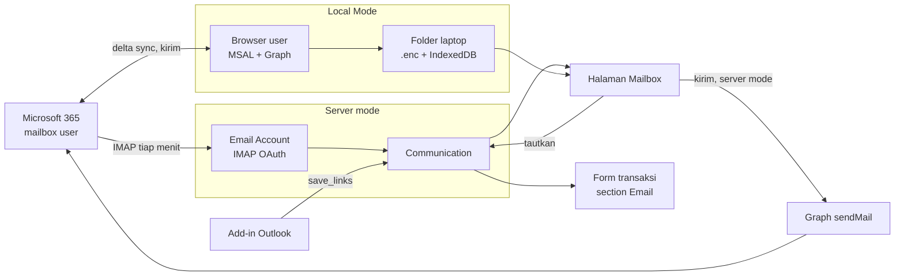

# Mail ERPNext Binding Microsoft 365 - Flow and Settings

Referensi lengkap Mailbox di app `erpnext_custom`: kebutuhan, arsitektur, setelan Azure dan ERPNext,
peta kode, gotcha, dan langkah membangun ulang. Ditulis supaya AI atau developer lain bisa meniru
sistem ini dari nol tanpa konteks percakapan pembuatnya. Per 2026-09-24.

**Untuk AI yang membaca ini:** baca berurutan. Kode acuan ada di repo ini (path di bagian Peta kode,
relatif ke paket `erpnext_custom/erpnext_custom/`). Bangun per langkah di "Langkah replikasi" dan
jalankan tesnya sebelum lanjut. Jangan menaruh Client ID, Tenant ID, secret, atau kunci di kode:
semuanya diisi lewat desk dan tersimpan di database.

Mailbox ERPNext membaca, mengirim, dan menautkan email Microsoft 365 ke transaksi ERP, untuk 50+
user tanpa menimbun email di server.

## Daftar isi

1. [Kebutuhan](#kebutuhan)
2. [Arsitektur](#arsitektur)
3. [Setelan Microsoft Entra (Azure)](#setelan-microsoft-entra-azure)
4. [Setelan ERPNext](#setelan-erpnext)
5. [Peta kode](#peta-kode)
6. [Server mode](#server-mode)
7. [Local Mode](#local-mode)
8. [Enkripsi, kunci, dan reset](#enkripsi-kunci-dan-reset)
9. [Tautan email ke transaksi](#tautan-email-ke-transaksi)
10. [Spesifikasi tampilan](#spesifikasi-tampilan)
11. [Signature perusahaan](#signature-perusahaan)
12. [Gotcha](#gotcha)
13. [Langkah replikasi dari nol](#langkah-replikasi-dari-nol)
14. [Pasang di server lain (prod)](#pasang-di-server-lain-prod)
15. [Cara uji dan status](#cara-uji-dan-status)

## Kebutuhan

Semua kebutuhan datang dari pemilik sistem (perusahaan ekspedisi, 50+ user, Microsoft 365). Kolom
kanan adalah keputusan yang sudah dibangun; ikuti keputusan itu kalau meniru.

| Kebutuhan | Keputusan |
| --- | --- |
| Kirim dan terima email Microsoft 365 dari ERPNext | Terima lewat IMAP OAuth (Connected App). Kirim lewat Microsoft Graph `sendMail`, karena tenant memblokir SMTP AUTH. |
| Semua folder Outlook ikut, termasuk Sent Items | Tarik per folder IMAP. Folder bertanda Sent dicatat sebagai email Terkirim. |
| Tampilan seperti Outlook web | Halaman desk `/desk/mailbox`: daftar di kiri, isi di kanan. Folder ada di sidebar kiri desk. |
| Menu Inbox dan Sent membuka Mailbox, bukan list Communication | Item sidebar menu Mail = Page `mailbox` dengan `?folder=Inbox` atau `?folder=Sent`. |
| Filter tanggal, rentang maksimal 1 bulan | DateRange di baris judul. Rentang lebih panjang dipotong ke 1 bulan dengan pesan. |
| Email terbaru langsung terbuka | Buka otomatis email paling atas saat folder dibuka, tanpa menandainya dibaca. |
| Tautkan email ke nomor transaksi, boleh lebih dari satu | Modal Link to Transaction: 5 Packing List terbaru, cari di semua modul, ledger dan log tidak bisa dicari. |
| Balasan di percakapan yang sama ikut tertaut | Tautan berlaku untuk seluruh percakapan; email baru mewarisi tautan percakapannya. |
| Email tertaut tampil di form transaksi | Section Email sendiri di atas Comments, disembunyikan dari Activity, tidak tampil di tab Assistant. |
| Notifikasi email baru | Notification Log tipe Alert, lonceng + toast. Server mode dari tarikan IMAP; Local Mode dilaporkan browser (`notify_local_mail`). |
| Mailbox hanya untuk user tertentu | Role `Mailbox User` (selain System Manager) membuka halaman Mailbox; admin memberikannya per user. |
| Siapa boleh menautkan email | Siapa pun yang boleh membaca transaksinya. Izin tulis Communication tidak dipakai. |
| 50+ user, sekitar 50 GB email, server jangan penuh | Local Mode: email diambil browser langsung dari Microsoft dan disimpan di laptop user. Server hanya menyimpan email yang ditautkan. |
| User memilih folder laptop dan folder Outlook yang disimpan | Folder laptop lewat File System Access API; folder Outlook dipilih di Settings. |
| Batas simpan di laptop | Satu setelan admin, bawaan 30 hari; yang lebih lama dibaca langsung dari Microsoft. |
| Folder email di laptop dikunci | AES-256-GCM, kunci per user dipegang server. Ekspor kunci satuan dan massal + alat dekripsi offline. |
| Reset kalau user salah email | Reset otomatis saat email User berganti + tombol Reset Mailbox. |
| Composer rapi | Baris From \| To \| CC lalu Subject \| CC (CC satu blok), lampiran dan transaksi berdampingan dan bergulir ke samping, tombol ikon, Send dan Cancel di kanan bawah. |
| Lampiran seperti Outlook | Tile: ikon jenis file, nama di bawahnya, maksimal 2 baris. |
| Bahasa UI | Semua teks Mailbox bahasa Inggris. Tombol tarik bernama Sync. |
| Signature perusahaan seragam | Template Jinja + Signature Builder drag and drop. Alamat dan telepon dari master Branch, HP dari profil User. |
| Mode laptop diatur admin | Centang Local Mode di ERPNext Custom Setting, berlaku untuk semua user. |

## Arsitektur

Satu halaman Mailbox, dua sumber data. Admin memilih lewat centang Local Mode; kedua mode memakai
tampilan, composer, dan modal tautan yang sama.



Panah ke Communication hanya terjadi untuk email yang ditautkan (Local Mode dan add-in) atau semua
email (Server mode).

- **Server mode.** Email Account menarik IMAP tiap menit ke doctype `Communication`. Halaman Mailbox
  membaca Communication. Kirim lewat alur bawaan Frappe (Email Queue), lalu hook `override_email_send`
  meneruskannya ke Graph. Cocok untuk satu atau beberapa mailbox bersama.
- **Local Mode.** Browser tiap user login ke Microsoft (MSAL, aplikasi SPA) dan memanggil Graph
  langsung: sinkron delta, baca, kirim, rule. Email disimpan terenkripsi di folder laptop pilihan
  user; indeks di IndexedDB. Server tidak menyimpan email kecuali yang ditautkan. Ini mode untuk 50+ user.
- **Pola kode.** `class LocalMailbox extends Mailbox` hanya mengganti sumber data: `fetch_rows`,
  `fetch_doc`, `persist_seen`, `fetch_links`, `save_links`, `deliver`, `load_attachments`. Semua
  tampilan tetap milik `Mailbox`.
- **Tautan ke transaksi.** Selalu lewat Communication: `reference_doctype/name` + tabel
  `timeline_links` (Communication Link). Form transaksi membaca tautan itu untuk section Email.
- **Add-in Outlook** (prototipe) memakai endpoint yang sama dengan Local Mode
  (`outlook_addin.lookup`, `save_links`).

## Setelan Microsoft Entra (Azure)

Satu app registration (single tenant) melayani kedua mode. Admin tenant cukup mengaturnya sekali.

1. **App registration** baru, akun di tenant ini saja. Catat Application (client) ID dan Directory
   (tenant) ID.
2. **Platform Web** (Server mode, dipakai Connected App Frappe). Redirect URI persis:
   `https://<domain ERP>/api/method/frappe.integrations.doctype.connected_app.connected_app.callback/<nama Connected App>`.
   Buat **client secret** di Certificates & secrets. Azure hanya menerima `http://` untuk `localhost`.
3. **Platform Single-page application** (Local Mode). Redirect URI persis:
   `https://<domain ERP>/assets/erpnext_custom/mailbox_auth.html`. Jangan didaftarkan di platform Web.
4. **API permissions, Delegated**, lalu **Grant admin consent** supaya user tidak ditanya satu per satu:

| Izin | Dipakai oleh |
| --- | --- |
| `offline_access` | Server mode (refresh token) |
| Office 365 Exchange Online `IMAP.AccessAsUser.All` | Server mode, tarik IMAP |
| Office 365 Exchange Online `SMTP.Send` | Server mode (diminta Connected App; kirimnya tetap lewat Graph) |
| Microsoft Graph `Mail.Send` | Server mode (token Graph dari refresh token yang sama) dan Local Mode |
| Microsoft Graph `Mail.ReadWrite` | Local Mode: sinkron, tandai dibaca, draf |
| Microsoft Graph `User.Read` | Local Mode: cek akun yang login = email User ERP |
| Microsoft Graph `MailboxSettings.ReadWrite` | Local Mode tab Rule (opsional, diminta terpisah) |

5. **Mailbox**: IMAP harus aktif untuk mailbox Server mode. SMTP AUTH boleh tetap mati.

| Kode galat | Arti | Perbaikan |
| --- | --- | --- |
| AADSTS700016 | Client ID salah (pernah terisi nilai secret) | Tempel Application (client) ID, bukan secret |
| AADSTS50011 | Redirect URI tidak cocok persis | Samakan dengan `redirect_uri` di Connected App, termasuk http/https dan host |
| AADSTS9002326 | Redirect SPA terdaftar di platform Web | Pindahkan ke platform Single-page application |
| SMTP 535 5.7.139 | SMTP AUTH dimatikan tenant | Kirim lewat Graph (lihat Server mode) |

## Setelan ERPNext

Stack: Frappe/ERPNext v16 di Docker, app kustom `erpnext_custom`. Setelan di bawah diisi lewat desk;
field kustomnya dibuat kode di `after_migrate` (lihat Peta kode).

**Wajib untuk kedua mode**

| Tempat | Isian |
| --- | --- |
| `site_config.json` | `host_name` = alamat publik ERP persis (dipakai membentuk redirect URI Connected App) |
| Scheduler | Aktif (`bench enable-scheduler`); tarik IMAP dan antrean email bergantung padanya |
| User | Email User = alamat mailbox Microsoft-nya. `branch` (Link ke CMI Office), `cmi_job_title` (Job Title), `mobile_no` untuk signature |
| Branch | `address` (Small Text, satu baris per baris alamat) dan `cmi_phone`. Nama Branch sama dengan nama CMI Office |
| Menu desk Mail | Item Inbox = Page `mailbox` + route_options `{"folder": "Inbox"}`, Sent = `{"folder": "Sent"}`; dibangun `desk_menu.ensure_menus()` dari `desk_menus_spec.py` |

**Server mode**

| Tempat | Isian |
| --- | --- |
| Connected App | Provider Microsoft; Client ID + Client Secret (platform Web); Authorization URI `https://login.microsoftonline.com/<tenant>/oauth2/v2.0/authorize`; Token URI `.../oauth2/v2.0/token`; scope `offline_access`, `https://outlook.office.com/IMAP.AccessAsUser.All`, `https://outlook.office.com/SMTP.Send`. Klik Connect sebagai pemilik mailbox (menghasilkan Token Cache) |
| Email Account | Auth Method OAuth + Connected App di atas; IMAP `outlook.office365.com:993` SSL; Enable Incoming; Email Sync Option `ALL`; Enable Outgoing + Default Outgoing; custom field `cmi_graph_connected_app` = Connected App yang sama (artinya: kirim lewat Graph) |
| Tabel IMAP Folder | `INBOX`, folder kustom yang mau ditarik, dan `Sent Items` dengan centang `cmi_is_sent` (Folder Terkirim) |
| User Email | Baris di User untuk setiap user yang membuka mailbox itu. Frappe hanya membuatnya otomatis kalau email User sama persis dengan email_id akun |

**Local Mode** (ERPNext Custom Setting, tab Mailbox)

| Field | Isi |
| --- | --- |
| `mailbox_local_mode` | Centang = semua user memakai Local Mode |
| `mailbox_client_id`, `mailbox_tenant_id` | ID app registration yang punya platform SPA |
| `mailbox_keep_days` | Hari email disimpan di laptop, bawaan 30, 0 = semua |
| `mailbox_sync_seconds` | Interval sinkron otomatis, bawaan 60, minimal 15 |
| `mailbox_signature_company`, `mailbox_signature_layout`, `mailbox_signature_template` | Signature perusahaan (lihat bagian Signature) |

Hak akses:

- Halaman Mailbox (menu Inbox/Sent) terbuka untuk **System Manager** dan role **Mailbox User**
  (`page/mailbox/mailbox.json`; role dibuat `mail_inbox.ensure_mailbox_role` di `after_migrate`).
  User lain hanya melihat Delete dan Notification Settings di menu Mail. Berikan role ini di form
  User untuk setiap orang yang memakai Mailbox.
- Menautkan dan melepas tautan: siapa pun yang boleh membaca transaksinya (lihat Tautan email ke
  transaksi). `get_links` hanya mengembalikan transaksi yang boleh dibaca user.
- Export Mailbox Key hanya System Manager.

## Peta kode

Path relatif ke `erpnext_custom/erpnext_custom/`. Tidak ada perubahan di Frappe atau ERPNext inti;
perilaku bawaan diubah lewat hook.

| File | Isi penting |
| --- | --- |
| `mail_inbox.py` | Server mode dan tautan. `CMIInboundMail` (catat `imap_folder`, Sent = Terkirim), `get_inbound_mails` + `sync_rule` + `_fetch` (tarik per folder), `pull_often`, `pull_now`, `mailbox_state`, `notify_new_mail`, `conversation`, `get_links`, `link_transaction` / `unlink_transaction`, `inherit_conversation_links`, `linked_emails` / `linked_email`, `backfill`, `trim_file_name`, custom field `MAIL_FIELDS`, role `MAILBOX_ROLE` + `ensure_mailbox_role` |
| `graph_mail.py` | `CMIEmailAccount` (override doctype Email Account), `send` (hook `override_email_send`), `_graph_token` (tukar refresh token ke token Graph), custom field `GRAPH_FIELDS` |
| `outlook_addin.py` | Endpoint Local Mode dan add-in: `mailbox_config`, `mailbox_key`, `export_mailbox_key`, `export_mailbox_keys`, `notify_local_mail`, `lookup`, `save_links`, `_import` |
| `quick_search.py` | Pencarian nomor transaksi: `find_transactions`, `transaction_doctypes` (tanpa ledger/log), `latest_transactions` (5 Packing List terbaru) |
| `erpnext_custom/page/mailbox/mailbox.js` | Halaman Mailbox: `class Mailbox` (tampilan, composer, modal tautan, sidebar) dan `class LocalMailbox extends Mailbox` (sumber data Local Mode, Settings 3 tab) |
| `public/js/mailbox_local.js` | Mesin Local Mode `LocalMail`: MSAL, Graph, sinkron delta, file laptop, IndexedDB, enkripsi, reset. Dimuat di semua halaman desk |
| `public/mailbox_auth.html` | Redirect URI SPA untuk login MSAL |
| `public/mailbox_decrypt.html` | Alat dekripsi offline, satu file tanpa library luar |
| `public/vendor/` | `msal-browser` 5.23.0 dan `postal-mime` 3.0.0, di-vendor (MSAL melarang dari CDN) |
| `public/js/linked_mail.js` | Section Email di form transaksi (event `form-refresh`) |
| `public/js/notification_badge.js` | Lonceng + toast email baru (polling) |
| `public/js/user.js`, `public/js/user_list.js` | Tombol Export Mailbox Key (form User) dan menu Export Mailbox Keys (daftar User) |
| `erpnext_custom/doctype/mailbox_signature/` | Doctype Mailbox Signature, `signature_context`, `company_signature`, `SIGNATURE_FIELDS` (User `cmi_job_title`, Branch `cmi_phone`) |
| `public/js/signature_builder.js` | Signature Builder drag and drop di ERPNext Custom Setting |
| `public/outlook/` | Add-in Outlook (prototipe): `manifest.xml`, `taskpane.html`, `taskpane.js` |
| `desk_menus_spec.py`, `desk_menu.py` | Menu Mail di sidebar desk |
| `install.py` | `after_migrate`: `create_custom_fields` untuk semua field di atas, urutan field Branch (`BRANCH_LAYOUT_LEAD`) |

Hook di `hooks.py`:

```python
override_doctype_class = {"Email Account": "erpnext_custom.graph_mail.CMIEmailAccount"}
override_email_send = "erpnext_custom.graph_mail.send"
scheduler_events = {"cron": {"* * * * *": ["erpnext_custom.mail_inbox.pull_often"]}}
doc_events = {
    "File": {"before_insert": "erpnext_custom.mail_inbox.trim_file_name"},
    "Communication": {"after_insert": "erpnext_custom.mail_inbox.inherit_conversation_links"},
}
app_include_js = [
    "/assets/erpnext_custom/js/notification_badge.js?v=11",
    "/assets/erpnext_custom/js/linked_mail.js?v=5",
    "/assets/erpnext_custom/js/mailbox_local.js?v=6",
]
doctype_js = {"User": "public/js/user.js"}
doctype_list_js = {"User": "public/js/user_list.js"}
```

Naikkan `?v=` setiap file di `app_include_js` berubah: nginx menyajikan `/assets` tanpa
Cache-Control, jadi browser memakai salinan lama.

## Server mode

Email ditarik server ke `Communication` tiap menit dan dikirim lewat Graph. Tiga bagian bawaan
Frappe harus diganti karena rusak untuk banyak folder dan tenant tanpa SMTP AUTH.

**Tarik IMAP per folder** (`CMIEmailAccount.get_inbound_mails` -> `mail_inbox.get_inbound_mails`)

- Mode `ALL` bawaan memakai UID tertinggi seluruh akun untuk semua folder dan aturan satu folder
  bocor ke folder lain. Pengganti: loop per folder, titik awal dihitung dari UID tertinggi folder itu
  sendiri (`sync_rule` -> `UID N:*`).
- Folder yang baru didaftarkan mulai dari ujungnya (`UIDNEXT`), bukan dari surat pertama. Surat lama
  masuk lewat `backfill()` yang senyap.
- `_seed_uidvalidity` menyimpan UIDVALIDITY per folder dan mengenali folder `\Sent` lewat perintah LIST.
- Server IMAP menjawab `UID N:*` dengan surat terakhir walau tidak ada surat baru (RFC 3501).
  `_fetch` membuang UID di bawah titik awal. Dulu satu tarikan kosong makan 21 detik, sekarang 5 detik.
- `frappe.db.commit()` per folder, supaya satu folder gagal tidak membatalkan yang lain.
- `CMIInboundMail` mencatat `Communication.imap_folder`, memindah folder kalau surat dipindah di
  Outlook, dan mencatat surat dari folder Sent sebagai `sent_or_received = Sent`, `seen = 1`. Kiriman
  ERP yang sama dikenali lewat Message-ID supaya tidak dobel.
- Hook `File.before_insert` (`trim_file_name`) memotong nama lampiran jadi 140 karakter. Nama lebih
  panjang menggagalkan satu batch tarikan.

**Jadwal dan tombol Sync**

- Cron tiap menit `pull_often`; bawaan Frappe cuma tiap 10 menit.
- Tombol Sync (`pull_now`) memakai nama job yang sama dengan tarikan terjadwal,
  `pull_from_email_account|<akun>`. Nama berbeda membuat dua tarikan saling menunggu kunci baris
  Email Account.
- Halaman memantau hasil lewat polling `mailbox_state` (bukan `frappe.realtime`, yang di desk ini
  diam-diam tidak terpasang).

**Kirim lewat Graph** (`graph_mail.send`, hook `override_email_send`)

- Composer memanggil `frappe.core.doctype.communication.email.make`; Frappe membuat Email Queue
  seperti biasa.
- `send()` memeriksa `cmi_graph_connected_app` di Email Account. Terisi: MIME utuh (base64) di-POST ke
  `/me/sendMail`, batas 4 MB, Bcc ditambahkan ke header, satu kirim per antrean. Kosong: jatuh ke
  SMTP bawaan.
- Token Graph didapat dengan menukar refresh token Connected App IMAP ke scope
  `offline_access https://graph.microsoft.com/Mail.Send` (refresh token Microsoft tidak terikat
  resource). Token disimpan di `frappe.cache`.
- **Jangan pernah `save()` Token Cache.** Kedaluwarsa token dihitung dari `modified + expires_in`;
  menyimpan ulang memalsukan umurnya dan IMAP gagal AUTHENTICATE.
- `CMIEmailAccount.validate_smtp_conn` dilewati untuk akun Graph.

**Notifikasi**

`CMIEmailAccount.receive` mengumpulkan surat baru; `notify_new_mail` membuat Notification Log tipe
Alert untuk setiap user yang punya baris User Email akun itu, dengan link
`/desk/mailbox?open=<Communication>`. Tipe Alert tidak pernah memicu email, jadi tidak ada lingkaran.
`notification_badge.js` menggambar angka lonceng dan toast lewat polling.

## Local Mode

Browser tiap user menjadi klien Microsoft Graph; server ERP hanya memberi setelan, kunci, dan
menyimpan email yang ditautkan. Semua ada di `public/js/mailbox_local.js` (`class LocalMail`).
Browser yang didukung: Edge dan Chrome (File System Access API). Butuh https (kecuali localhost).

**Siklus hidup**

1. `LocalMail.shared()` membuat satu mesin per tab dari `outlook_addin.mailbox_config` (client_id
   kosong = Local Mode mati). File ini ada di `app_include_js`, jadi sinkron otomatis jalan di halaman
   desk mana pun, tapi hanya kalau penanda localStorage `erp-mailbox-ready|<user>` ada (dipasang saat
   Mailbox berhasil tersambung).
2. `init()`: buka IndexedDB `erp-mailbox|<user ERP>` (store `messages` dengan index `folder_date`,
   `folder_seen`, `imid`, `pending`; store `kv`), ambil kunci enkripsi, cek email mailbox berganti,
   siapkan MSAL (`PublicClientApplication`, authority `https://login.microsoftonline.com/<tenant>`,
   redirect `mailbox_auth.html`, cache `localStorage`), buka folder laptop.
3. `login()`: `loginPopup` dengan scope `Mail.ReadWrite`, `Mail.Send`, `User.Read` dan `loginHint` =
   email User. Sesudah login, `/me` dicek: alamatnya harus sama dengan email User ERP, kalau tidak
   cache dibersihkan dan login ditolak.
4. `token()`: `acquireTokenSilent`. Gagal = `NeedAction("login")`; refresh token SPA berumur 24 jam,
   jadi user sesekali klik Sign in lagi. Email di laptop tetap terbaca.
5. `graph()`: header `Prefer: IdType="ImmutableId"` (id tetap walau email dipindah folder), ulang
   otomatis untuk 429/503/504 memakai `Retry-After`.

**Folder laptop**

- `showDirectoryPicker({id: "erp-mailbox", mode: "readwrite"})`; handle disimpan di kv `root`. Izin
  berlaku per sesi browser; halaman meminta ulang dengan satu klik. Browser tanpa picker jatuh ke OPFS
  (`navigator.storage.getDirectory()`).
- Susunan: `<folder pilihan>/<email mailbox>/<folder Outlook>/<yyyy-mm>/<yyyymmdd-hhmm> <tanda>.enc`,
  tanda = 8 karakter pertama SHA-1 id Graph. Jalur disimpan relatif, jadi folder yang dipindah user
  cukup dipilih ulang.

**Sinkron**

- Satu tab saja yang menyinkron: `navigator.locks.request("erp-mailbox-sync|<mailbox>", {ifAvailable: true})`.
- Per folder Outlook yang dipilih: delta query
  `/me/mailFolders/{id}/messages/delta?$select=...&$filter=receivedDateTime ge <batas>&$orderby=receivedDateTime desc`,
  `Prefer: odata.maxpagesize=100`. Titik lanjut disimpan tiap halaman sebagai `{link, days}`; 410
  (delta kedaluwarsa) = ulang dari awal.
- `apply()`: `@removed` menghapus baris dan file (kalau masih di folder itu), email pindah folder =
  file ikut dipindah, lainnya digabung ke baris indeks dan diantrekan unduh (`pending` = tanggal,
  terbaru dulu).
- `download_pending()`: kunci `erp-mailbox-download|<mailbox>`, jalankan `migrate()` dulu, lalu 3
  pekerja paralel (Graph menolak lebih dari 4 permintaan serentak per mailbox) mengunduh
  `/me/messages/{id}/$value` ke file terenkripsi.
- `prune()` tiap sinkron menghapus baris dan file yang lebih tua dari `mailbox_keep_days`, termasuk
  folder bulan yang kosong. Email lebih lama dibaca langsung dari Graph lewat `older()` (tombol
  "Show email older than N days").
- Sinkron otomatis tiap `mailbox_sync_seconds` (minimal 15). Tab yang tidak terlihat dibatasi browser
  sendiri sekitar sekali semenit.
- **Notifikasi email masuk.** Server tidak melihat email Local Mode, jadi `notify_new_mail` tidak
  jalan. Sebagai gantinya `apply()` mengumpulkan baris BARU yang belum dibaca di folder berjenis
  `inbox`, hanya kalau folder itu disinkron dari delta lanjutan (`this.collect`; sinkron awal dan
  ulang-dari-awal sengaja diam supaya email lama tidak membanjiri). Sesudah sinkron, `notify_fresh()`
  mengirim maksimal 20 email yang umurnya di bawah sehari ke `outlook_addin.notify_local_mail`, yang
  membuat Notification Log untuk user yang login saja: subjek "New email from <pengirim>: <subjek>"
  (di-escape), link `/desk/mailbox?message_id=<Message-ID>`. Lonceng dan toast lalu jalan lewat
  `notification_badge.js` seperti Server mode. Yang dikirim ke server hanya pengirim, subjek, dan
  Message-ID.

**Baca dan kirim**

- `get(id)`: file didekripsi, di-parse `postal-mime`; gambar `cid:` jadi data URL (iframe baca
  ber-sandbox tidak bisa memuat blob URL), lampiran jadi blob URL.
- `send()`: buat draf (`createReply`, `createReplyAll`, `createForward`, atau pesan baru), PATCH
  subjek/isi/penerima, lampiran (sampai 3 MB langsung, di atasnya upload session per potongan
  12 x 320 KiB), gambar tempel dan signature jadi lampiran inline `cid:`, lalu `/send`. Draf dipakai
  supaya balasan membawa header utas Outlook.
- Tab Rule di Settings mengelola rule Outlook asli lewat `/me/mailFolders/inbox/messageRules` dengan
  scope terpisah `MailboxSettings.ReadWrite`.

**Menautkan dari Local Mode**

Email belum ada di server. `save_links(mailbox, message_id, links, eml_b64)` mengirim .eml utuh;
server mengimpornya lewat `CMIInboundMail` (jalur yang sama dengan tarikan IMAP, flag
`cmi_mail_backfill` supaya tidak memicu notifikasi) lalu menautkannya. Satu Message-ID = satu
Communication di seluruh sistem.

## Enkripsi, kunci, dan reset

Salinan email di laptop terbaca hanya selama user bisa login ERP. File yang disalin keluar, laptop
yang hilang, atau akun yang dinonaktifkan = isinya tidak terbaca. Email aslinya tetap di Microsoft,
jadi kehilangan salinan lokal tidak pernah berarti kehilangan data.

**Kunci**

- Satu kunci AES-256 acak per user, disimpan di tabel `__Auth` Frappe (`doctype = "User"`,
  `name = <user>`, `fieldname = "cmi_mailbox_key"`), dienkripsi `encryption_key` situs seperti field
  Password. Bukan kolom User, jadi tidak ikut tampil atau terekspor bersama dokumen User.
- Dibuat pertama kali lewat `INSERT IGNORE`, lalu dibaca ulang: dua tab yang meminta bersamaan tetap
  berakhir dengan satu kunci. `set_encrypted_password` tidak dipakai karena menimpa.
- Browser mengambilnya lewat `outlook_addin.mailbox_key` (POST, user yang login saja), mengimpornya
  sebagai `CryptoKey` non-extractable, dan menyimpannya di memori saja.
- Backup database + `site_config.json` = backup kunci. Hilang keduanya = salinan laptop tidak
  terbaca; Mailbox mengunduh ulang dari Microsoft.

**Apa yang dienkripsi**

- Isi file: setiap `write_file` menulis format di bawah; `read_file` mendekripsi (file polos lama
  dibaca apa adanya sampai dimigrasi).
- Indeks IndexedDB: kolom `subject`, `from_name`, `from_addr`, `to`, `cc`, `preview`, `imid` disegel ke
  `row.sec`; yang tersisa terbuka hanya `id`, `folder`, `date`, `seen`, `has_att`, `pending`, `path`.
  Index `imid` berisi SHA-256 Message-ID. Hasil dekripsi di-cache di memori per IV.
- Nama file tanpa subjek.

```text
Format file .enc
  byte 0-3    "CME1" (ASCII)
  byte 4-15   IV acak 12 byte
  byte 16-    ciphertext AES-256-GCM, diakhiri tag 16 byte (keluaran WebCrypto)
```

**Migrasi dan pergantian kunci**

- `migrate()` berjalan sekali per folder penyimpanan (flag kv `sealed`) di dalam kunci unduhan: file
  `.eml` polos dibaca, ditulis ulang terenkripsi dengan nama baru, file lama dihapus, baris indeks
  disegel. Tanpa unduh ulang. `change_root()` mengembalikan flag supaya folder lain ikut diperiksa.
- kv `key_check` = segel kecil memakai kunci saat ini. Gagal dibuka (kunci berganti, misalnya situs
  dipulihkan tanpa `site_config.json` lama) = indeks dikosongkan dan dibangun ulang dari Microsoft.

**Membuka tanpa ERP**

- Satu user: form User, grup Password, **Export Mailbox Key** (System Manager). Dialog menampilkan
  kunci, tombol Copy Key, dan link unduh alat dekripsi.
- Banyak user: daftar User, menu **Export Mailbox Keys**. User yang dicentang, atau semua user yang
  punya kunci, jadi satu file `mailbox_keys_<tanggal>.csv` berkolom `user,email,key`.
- Setiap ekspor mencatat Comment "Mailbox key exported by <user>" di timeline User pemilik kunci.
- `public/mailbox_decrypt.html`: buka di Edge/Chrome (boleh dari disk, tanpa internet), tempel satu
  kunci atau muat CSV, pilih folder email dan folder hasil. Setiap file dicoba dengan semua kunci
  (yang cocok dipindah ke depan), subjek dibaca dari header (RFC 2047 B/Q) untuk nama hasil
  `<yyyymmdd-hhmm> <subjek> <tanda>.eml`.
- Di dalam Mailbox, tombol **Download .eml** di panel baca memberi .eml polos satu email.

**Reset**

- Akun Microsoft salah saat login: ditolak di `login()`.
- Email User diganti admin: `init()` membandingkan kv `mailbox` dengan email sekarang; beda =
  `forget()` (indeks, titik sinkron, pilihan folder Outlook, akun) otomatis.
- Tombol **Reset Mailbox** (Settings, tab Local Email): `engine.reset()` menahan kunci sinkron dan
  unduhan, lalu keluar dari Microsoft, `forget()`, dan menghapus folder
  `<folder pilihan>/<email mailbox>`. Folder penyimpanan yang dipilih tetap.

## Tautan email ke transaksi

Satu tautan berlaku untuk seluruh percakapan: menautkan satu email ikut menautkan balasan sebelum dan
sesudahnya, dan balasan yang datang besok mewarisi tautan itu.

**Model data**

- Communication menunjuk transaksi lewat `reference_doctype` + `reference_name` (tautan pertama) dan
  tabel `timeline_links` / Communication Link (tautan berikutnya). `_link_one` mengisi reference kalau
  masih kosong, selain itu `add_link`.
- `link_transaction(communication, doctype, name)` memeriksa: doctype termasuk
  `quick_search.transaction_doctypes()` dan user boleh MEMBACA dokumen transaksi. Itu saja (keputusan
  pemilik sistem): izin tulis Communication sengaja tidak dipakai, karena bawaan Frappe hampir tidak
  memberikannya ke siapa pun (di prod hanya role Agent Manager), sehingga System Manager biasa pun
  tertolak. Lalu `_link_one` (simpan dengan `ignore_permissions`) untuk setiap anggota
  `conversation(communication)`. `unlink_transaction` kebalikannya dengan aturan yang sama.
- `get_links(communication)` tidak memeriksa izin Communication; hasilnya disaring ke transaksi yang
  boleh dibaca user.

**Apa itu satu percakapan** (`conversation(name)`, maksimal 300 email)

1. Rantai `in_reply_to` ke atas dan ke bawah.
2. Ditambah email dengan subjek yang sama sesudah awalan balas/terus dibuang (`Re`, `Fw`, `Fwd`, `AW`,
   `WG`, `TR`, termasuk `Re[2]:`), dalam rentang 30 hari, dan punya pihak luar yang sama (alamat
   Email Account sendiri tidak dihitung).

Langkah 2 perlu karena rantai `in_reply_to` sering putus: nilainya hanya terisi kalau surat induknya
sudah ada di ERP saat balasan masuk.

**Pewarisan otomatis** (`inherit_conversation_links`, hook `Communication.after_insert`)

Email baru menyalin semua tautan dari anggota percakapannya. Pewarisan bawaan Frappe hanya menyalin
reference utama, yang sering berisi "Communication <induk>", bukan transaksi. Penulisan memakai
`db_set` / `db_insert`, bukan `save()`, karena pemanggil (InboundMail, `make`) masih menyimpan dokumen
itu lagi.

**Modal Link to Transaction** (`pick_transactions` di mailbox.js)

- Awalnya berisi 5 Packing List terbaru (`latest_transactions`, keterangan: customer + tanggal). Ketik
  minimal 3 karakter untuk mencari nomor transaksi di semua modul (`find_transactions`).
- Yang tidak bisa dicari: GL Entry, Serial and Batch Bundle, Pricing Rule, Tax Rule, Auto Repeat dan
  sejenisnya, serta doctype berawalan `Repost` / `Process` atau berakhiran ` Log` / `Ledger Entry`.
- Bisa pilih lebih dari satu. Balasan dan terusan otomatis membawa tautan email aslinya.

**Section Email di form transaksi** (`public/js/linked_mail.js`)

- Dipasang lewat event `form-refresh`, disisipkan sebelum `.comment-box`, hanya muncul kalau ada email
  tertaut (`linked_emails`). Isi email dibuka lewat `linked_email`, izinnya dari dokumen transaksi.
- Email yang sudah tampil di sini disembunyikan dari Activity lewat CSS
  `:has(> .timeline-badge[title="Mail"])`. Section tidak tampil saat tab Assistant aktif.
- Tombol Balas / Balas Semua / Teruskan membuka composer di halaman Mailbox
  (`frappe.route_options = {open, compose, message_id}`); Lepas tautan melepas seluruh percakapan.

**Add-in Outlook** (prototipe, `public/outlook/`)

- Manifest XML (MailApp, panel baca, bisa di-pin), `taskpane.html/js` dengan Office.js:
  `item.getAsFileAsync` (Mailbox 1.14) mengambil .eml, `internetMessageId` untuk mencari email di ERP.
- Autentikasi sementara: API key:secret user ERP di `roamingSettings`, karena cookie ERP tidak
  terkirim di iframe pihak ketiga. Untuk 50+ user rencananya diganti SSO Entra.
- Butuh https dan header `frame-ancestors` yang mengizinkan domain Outlook. Lokal memakai kontainer
  nginx di port 8443 dengan sertifikat self-signed yang dipercaya manual. Alamat di `manifest.xml`
  masih `https://localhost:8443`.

## Spesifikasi tampilan

Mailbox meniru Outlook web di dalam desk ERPNext. Semua teks bahasa Inggris, tanpa emoji atau simbol
hias.

```text
+-- sidebar desk (menu Mail) --+-- baris judul ----------------------------------------------+
| Inbox            3776        | Mailbox  [Search sender or subject] [Date]   Sync  New Email  |
| Notification       48        +---------------------+----------------------------------------+
| Sent                         | daftar email        | panel baca / composer                  |
| Spam                         | (360 px)            |                                        |
| Trash                        |                     |                                        |
| Settings  (Local Mode)       |                     |                                        |
| Delete, Email Account, ...   |                     |                                        |
+------------------------------+---------------------+----------------------------------------+
```

**Baris judul dan sidebar**

- Search (Data, 220 px) dan Date (DateRange) disisipkan tepat sesudah `page.$title_area`; baris form
  halaman disembunyikan (`page.hide_form()`). Kanan: Sync (tombol sekunder, ikon refresh) dan
  New Email (tombol utama). Menu titik tiga kosong, jadi tidak tampil.
- Date: rentang lebih dari 1 bulan dipotong ke `mulai + 1 bulan - 1 hari`, dengan pesan
  "Date range is limited to 1 month".
- Folder tampil di sidebar kiri desk, bukan di halaman. Selama Mailbox terbuka, item sidebar yang
  href-nya `/desk/mailbox...` disembunyikan dan diganti daftar folder (`mount_sidebar`); dikembalikan
  saat halaman ditinggal (event `hide`). Markup item meniru `sidebar_item.html` bawaan
  (`sidebar-item-container` > `standard-sidebar-item` > `a.item-anchor`, kelas aktif
  `active-sidebar`), ikon lucide: `inbox`, `send`, `folder`, `shield-alert`, `trash-2`, `file-pen`,
  `settings`, plus angka belum dibaca.
- Pemilih akun hanya tampil kalau ada lebih dari satu akun (Local Mode selalu satu).
- `?folder=Inbox|Sent` dibaca sekali lalu dibuang dari alamat, supaya tombol Back tidak memaksa
  folder itu lagi.

**Panel baca**

- Subjek, pengirim, To, Cc, tanggal; tile lampiran; chip transaksi dengan tombol X; tombol Reply,
  Reply All, Forward, Open Document (Server mode) atau Download .eml (Local Mode), Link to.
- Badan email dirender di `<iframe sandbox>` tanpa `allow-scripts`, latar putih. Jangan pernah
  menempel HTML email langsung ke halaman.

**Composer** (di panel kanan, bukan modal)

```text
| From          | To                  | CC             |
| Subject                             | (CC satu blok) |
| [klip] tile tile tile ... >  | [rantai] chip chip ... > |
|------------------------------------------------------|
| Message (mengisi sisa tinggi, minimal 320 px)        |
|                                       Cancel  Send   |
```

- Grid `grid-template-areas: "from to cc" "subject subject cc"`, kolom `1fr 1.4fr 1.4fr`. CC adalah
  `class CcControl extends frappe.ui.form.ControlMultiSelect { static html_element = "textarea" }`:
  saran kontak tetap jalan, tinggi 98 px.
- Di bawah Subject dua kotak berdampingan: kiri tombol ikon `paperclip` + tile lampiran, kanan tombol
  ikon `link` + chip transaksi. Isinya satu baris dan bergulir ke samping; roda mouse biasa ikut
  menggulir. Kosong = "No attachments" / "No linked transactions".
- Message: rantai flex sampai kotak Quill, isi panjang bergulir di dalam editor. Cancel lalu Send rata
  kanan bawah.
- Lebar di bawah 1100 px: semua satu kolom.

**Tile lampiran**

Lebar 92 px, ikon jenis file di atas, nama di bawah maksimal 2 baris (`-webkit-line-clamp: 2`,
`overflow-wrap: anywhere`), nama lengkap di tooltip. Ikon: gambar `file-image`, xls/xlsx/csv
`file-spreadsheet`, zip/rar/7z `file-archive`, pdf/doc/txt/ppt `file-text`, lainnya `file`. Di
composer ada ikon X di pojok kanan atas; elemennya `<span>`, bukan `<a>`, karena tautan di dalam
tautan dipecah browser.

## Signature perusahaan

Satu template untuk semua user, diisi data masing-masing user. Admin menyusunnya dengan Signature
Builder di ERPNext Custom Setting, tab Mailbox; user boleh punya signature sendiri (doctype Mailbox
Signature) yang menggantikannya kalau ditandai bawaan.

**Cara kerja builder** (`public/js/signature_builder.js`, dipasang `erpnext_custom_setting.js` di
field HTML `mailbox_signature_builder`)

- Sumber kebenaran = `mailbox_signature_layout` (JSON tersembunyi): `font`, `line_height`,
  `columns[]` berisi `width` dan `blocks[]`. Jenis blok: `field`, `text`, `image`, `social`, `spacer`;
  gaya per blok: `size` (pt), `color`, `bold`, `italic`, `underline`, `prefix`, `suffix`, `link`.
- Setiap perubahan membuat ulang `mailbox_signature_template` (Jinja). Blok field dibungkus
  ``, jadi baris yang datanya kosong hilang dari email. Prefix/suffix/teks bebas
  di-escape dan kurung kurawalnya dinetralkan supaya tidak menjadi ekspresi Jinja.
- Kanvas memakai data user yang sedang login (`signature_preview`). Field kosong tampil sebagai
  `[<Label> empty]` dengan tooltip bahwa baris itu tidak ikut di email.
- Drag and drop memakai `window.Sortable` yang sudah ada di bundel desk.
- Susunan dan template tersimpan di database, tidak di git. Server baru mendapat template bawaan
  `company_signature.html` (oleh `ensure_signature_template` di `after_migrate`).

**Placeholder dan sumber datanya** (`mailbox_signature.signature_context`, semua nilai sudah
di-escape karena template dirender tanpa autoescape)

| Placeholder | Label builder | Sumber |
| --- | --- | --- |
| `full_name` | Name | User first_name + last_name |
| `job_title` | Job Title | User `cmi_job_title` |
| `email` | Email | User email |
| `company` | Company | `mailbox_signature_company`, kalau kosong Company.company_name |
| `branch_office` | Branch Office | CMI Office.office_name dari User.branch |
| `office_address_lines` | Branch Address | Branch.address (nama sama dengan CMI Office), kalau kosong CMI Office.address; satu baris per baris |
| `office_phone` | Branch Phone | Branch `cmi_phone`, kalau kosong CMI Office.phone |
| `mobile_no` | Mobile | User mobile_no, kalau kosong User phone |
| `website`, `website_url` | Website | Company.website |

**Aturan yang terbukti perlu**

- Jangan mengetik data (nomor telepon, nomor HP) di Prefix atau Suffix. Nilainya ikut tercetak untuk
  semua user dan hilang kalau field-nya kosong. Isi master datanya: Branch untuk telepon dan alamat
  kantor, User untuk HP.
- Prefix cukup label pendek: `P: ` untuk Branch Phone, `M: ` untuk Mobile.

**Di composer**

Editor Quill hanya berisi ketikan user. Signature, garis pemisah, dan kutipan email asli dirender di
bawah editor (`render_tail`, iframe sandbox) lalu disambung saat Send (`final_body`), karena Quill
membuang tabel, ukuran huruf, dan garis. Gambar signature dikirim sebagai lampiran inline `cid:`.

## Gotcha

Semua baris di bawah sudah benar-benar terjadi saat membangun sistem ini. Baca sebelum menulis kode.

| Gejala | Penyebab | Perbaikan |
| --- | --- | --- |
| Kirim email gagal 535 5.7.139 | Tenant mematikan SMTP AUTH | Kirim lewat Graph `/me/sendMail` |
| IMAP tiba-tiba gagal AUTHENTICATE | Kode menyimpan Token Cache; umur token = `modified + expires_in` jadi terlihat segar | Jangan pernah `save()` Token Cache; paksa refresh dengan `set_value expires_in=0, update_modified=False` |
| Folder kedua tidak menarik surat / menarik surat folder lain | Mode ALL Frappe memakai UID tertinggi seluruh akun, aturan bocor antar folder | Override `get_inbound_mails`, titik awal per folder |
| Tarikan tanpa surat baru tetap lambat | `UID N:*` selalu mengembalikan surat terakhir (RFC 3501) | Buang UID di bawah titik awal sebelum mengunduh |
| Satu batch tarikan batal | Nama lampiran lebih dari 140 karakter | `File.before_insert` memotong nama, ekstensi dipertahankan |
| Lock wait timeout di Email Account | Tombol dan jadwal memakai nama job berbeda | Satu nama job `pull_from_email_account` + `\|<akun>`; commit per folder |
| Tombol menunggu selamanya | `frappe.realtime.on` di desk ini diam-diam tidak terpasang | Polling endpoint status |
| JS baru tidak terpakai | nginx menyajikan `/assets` tanpa Cache-Control | Naikkan `?v=` di `app_include_js` |
| `frappe.require("...js?v=2")` gagal | Ekstensi dibaca dari teks sesudah `?` | Jangan beri `?v=`; `frappe.require` menambah versi sendiri |
| Daftar kosong tanpa galat | `or_filters` berisi string kosong jadi filter `name = ''` | Jangan kirim kuncinya kalau tidak dipakai |
| Inbox tidak menampilkan akun | Baris User Email hanya dibuat otomatis kalau email User sama dengan email akun | Tambah baris User Email manual |
| Simpan Email Account baru gagal | Akun default lama (kredensial mati) disimpan ulang oleh `there_must_be_only_one_default` | Matikan flag default akun lama lewat `db_set` |
| Balasan tidak muncul di transaksi | Frappe hanya mewarisi reference utama; rantai `in_reply_to` sering putus | `conversation()` + hook `inherit_conversation_links` |
| Semua item sidebar Inbox/Sent menyala bersamaan | `is_route_in_sidebar` mengabaikan query string | Ganti item bawaan dengan item folder milik halaman |
| Folder di sidebar hilang setelah pindah halaman | Sidebar dirender ulang sesudah halaman tampil (router `change`) | Pasang ulang di handler `frappe.router.on("change")` |
| Baris form kosong di bawah judul | `page.add_field` selalu memanggil `show_form()` | `page.hide_form()` sesudah memindah field |
| Ikon X lampiran menumpuk di satu tempat | `<a>` di dalam `<a>` dipecah parser HTML | Tombol X memakai `<span role="button">` |
| TransactionInactiveError di IndexedDB | Menunggu WebCrypto di tengah kursor menutup transaksi | Kumpulkan baris dulu, dekripsi sesudahnya |
| Urutan field hilang sesudah menambah custom field | Frappe mengabaikan `field_order` yang panjangnya beda dari jumlah field | Tambahkan field baru ke daftar urutan (`BRANCH_LAYOUT_LEAD`, dsb.) |
| AADSTS9002326 | Redirect SPA terdaftar di platform Web | Daftarkan di platform Single-page application |
| MSAL menolak redirect bridge | Skrip MSAL dimuat dari CDN | Vendor ke `public/vendor/` |
| Iframe Outlook web di desk ditolak | Anti-clickjacking Microsoft | Add-in Outlook atau Local Mode |
| Tabel/ukuran huruf signature rusak saat membalas | Quill membuang format yang tidak dikenalnya | Render signature dan kutipan di luar editor, sambung saat kirim |
| Signature tercetak `P :0812+62 61 ...` | Nomor diketik di Prefix/Suffix, field salah | Field Branch Phone / Mobile, data di master Branch dan User |
| 502 Bad Gateway sesudah restart backend | nginx frontend memegang IP backend lama | Restart kontainer frontend juga |

## Langkah replikasi dari nol

Ikuti urutan ini; setiap langkah bisa diuji sebelum lanjut. Untuk AI: bangun satu langkah, jalankan
tesnya, baru lanjut.

1. **Prasyarat.** Frappe/ERPNext v16 dengan app kustom sendiri, akses admin tenant Microsoft 365, ERP
   di https dengan domain tetap (http hanya boleh untuk localhost).
2. **Entra.** Buat app registration sesuai bagian Setelan Microsoft Entra: platform Web + secret,
   platform SPA, izin delegated, admin consent.
3. **Kirim lewat Graph.** `graph_mail.py`: `CMIEmailAccount`, `send`, `_graph_token`, custom field
   `cmi_graph_connected_app`. Hook `override_doctype_class` + `override_email_send`. Uji: kirim email
   dari form mana pun.
4. **Tarik IMAP per folder.** `mail_inbox.py`: `CMIInboundMail`, `get_inbound_mails`, `sync_rule`,
   `_fetch`, `_seed_uidvalidity`, `pull_often`, `pull_now`, `mailbox_state`, `trim_file_name`, custom
   field IMAP Folder `cmi_is_sent`. Hook cron tiap menit + `File.before_insert`.
5. **Hubungkan mailbox.** Isi `host_name`, buat Connected App, klik Connect sebagai pemilik mailbox,
   buat Email Account (OAuth, IMAP, Sync Option ALL, tabel IMAP Folder, Sent Items dicentang), tambah
   baris User Email. Jalankan `backfill` kalau surat lama dibutuhkan.
6. **Pencarian transaksi.** `quick_search.py`: `transaction_doctypes`, `find_transactions`,
   `latest_transactions`.
7. **Tautan.** `get_links`, `link_transaction`, `unlink_transaction`, `conversation`,
   `inherit_conversation_links` (hook `Communication.after_insert`), `linked_emails`, `linked_email`;
   `public/js/linked_mail.js`.
8. **Halaman Mailbox.** Page `mailbox` dengan `class Mailbox` sesuai Spesifikasi tampilan. Menu desk
   Mail: Inbox/Sent = Page `mailbox` + `folder`. Notifikasi: `notify_new_mail` + `notification_badge.js`.
9. **Local Mode.** Vendor `msal-browser` dan `postal-mime` ke `public/vendor/`,
   `public/mailbox_auth.html`, `public/js/mailbox_local.js` (masuk `app_include_js`),
   `class LocalMailbox extends Mailbox`, endpoint `outlook_addin.mailbox_config` / `save_links` /
   `lookup`, field ERPNext Custom Setting tab Mailbox.
10. **Enkripsi.** `mailbox_key` / `export_mailbox_key` / `export_mailbox_keys`, lapisan enkripsi di
    `write_file` / `read_file` / `put_row` / `row`, `migrate`, `key_check`, `reset`, `forget`;
    `public/js/user.js`, `public/js/user_list.js`, `public/mailbox_decrypt.html`; tombol Download .eml
    dan Reset Mailbox.
11. **Signature.** Doctype Mailbox Signature, `signature_context`, `company_signature`,
    `signature_preview`, `SIGNATURE_FIELDS` (User `cmi_job_title`, Branch `cmi_phone`),
    `public/js/signature_builder.js`.
12. **Pasang.** Semua custom field lewat `create_custom_fields` di `after_migrate`, lalu `bench migrate`,
    `bench clear-cache`, restart backend + worker antrean (+ frontend kalau muncul 502). Naikkan `?v=`
    file JS yang berubah.
13. **Isi data.** Email User = alamat Microsoft; role Mailbox User; User `branch`, Job Title, Mobile No;
    Branch Address dan Phone; ERPNext Custom Setting tab Mailbox (Local Mode, Client ID, Tenant ID, 30 hari, 60 detik,
    nama perusahaan, susunan signature).
14. **Periksa akhir.** Terima dan kirim satu email; tautkan ke transaksi lalu balas dan pastikan
    balasannya ikut muncul di form; Local Mode: pilih folder, login, sinkron, buka email,
    Download .eml, ekspor kunci lalu buka file dengan `mailbox_decrypt.html`.

## Pasang di server lain (prod)

Kode sudah di repo; server baru hanya perlu dipasang dan diisi setelannya. Client ID, Tenant ID,
secret, kunci Mailbox, dan susunan signature ada di database, bukan di git.

1. Merge branch fitur ke branch prod, `git pull` di server.
2. `bench --site <situs> migrate`, `bench clear-cache`, restart backend, worker, dan frontend.
   Hati-hati: `bench migrate` pernah mengembalikan CRM Fields Layout ke bawaan Frappe; backup atau cek
   layout CRM sesudahnya.
3. Azure, app registration yang sama: tambah redirect SPA
   `https://<domain prod>/assets/erpnext_custom/mailbox_auth.html` dan (Server mode) redirect Web
   `https://<domain prod>/api/method/frappe.integrations.doctype.connected_app.connected_app.callback/<nama Connected App>`.
4. `site_config.json`: `host_name` = alamat prod, scheduler aktif, backup `encryption_key`.
5. ERPNext Custom Setting tab Mailbox: Local Mode, Client ID, Tenant ID, 30 hari, 60 detik, nama
   perusahaan; susun ulang signature (atau salin `mailbox_signature_layout` dan
   `mailbox_signature_template` dari server lama).
6. Master data: email User = akun Microsoft, Branch, Job Title, Mobile No, Address dan Phone tiap Branch.
   Beri role **Mailbox User** ke setiap user yang memakai Mailbox (System Manager tidak perlu).
7. Server mode (opsional): Connected App, Email Account, baris User Email.
8. Add-in Outlook (opsional): ganti alamat `https://localhost:8443` di `public/outlook/manifest.xml` ke
   domain prod, pasang header `frame-ancestors` untuk domain Outlook.

## Cara uji dan status

**Menjalankan kode di situs** (bench console tidak menampilkan hasil blok multi-baris dengan rapi,
jadi dibungkus `exec` dan output disaring):

```bash
docker exec -i <kontainer backend> bench --site <situs> console <<'PYEOF' 2>&1 | grep -a ZZ
exec(r'''
from erpnext_custom.mail_inbox import conversation
print("ZZ", conversation("<nama Communication>"))
''', globals())
PYEOF
```

**Tes yang ada**

| Tes | Menjaga |
| --- | --- |
| `from erpnext_custom.test_mail_folders import run; run()` | Titik awal per folder, unduhan idle, penandaan folder dan Terkirim, subjek percakapan |
| `from erpnext_custom.test_mailbox import run; run()` | Filter folder halaman, jebakan `or_filters` kosong, role Mailbox User di halaman, aturan tautan (user bukan System Manager boleh menautkan transaksi yang bisa dibacanya dan ditolak untuk yang tidak; rollback) |
| `from erpnext_custom.test_graph_mail import run; run()` | Bcc, tidak ada `token_cache.save(` di kode |
| `node erpnext_custom/test_mailbox_local.js` | Fungsi murni mesin Local Mode (`merge_row`, `safe_name`, `strip_id`, `recipients_of`) |

**Uji tampilan tanpa password** (dipakai untuk semua cek UI)

1. Di bench console, buat sesi Administrator: pasang `frappe.local.request` palsu dari
   `werkzeug.test.EnvironBuilder`, lalu `frappe.sessions.Session(user="Administrator", resume=False, ...)`
   dan `frappe.db.commit()`; ambil `sid`.
2. Playwright (Chromium headless) dengan cookie `sid` untuk `localhost`. Pemilih folder tidak bisa
   diklik mesin, jadi folder laptop diganti OPFS (`navigator.storage.getDirectory()`). Untuk memaksa
   Server mode, cegat `outlook_addin.mailbox_config` dan kembalikan `client_id` kosong.
3. Hapus sesinya sesudah selesai: `frappe.sessions.delete_session(sid)`.

Sesudah mengubah file .py: restart backend dan worker antrean, `bench clear-cache`, dan restart
frontend kalau muncul 502.

**Masih terbuka**

- [ ] Add-in Outlook masih memakai API key per user dan alamat localhost; untuk 50+ user ganti SSO
  Microsoft Entra.
- [ ] Section Email di form transaksi dan panel add-in masih berteks bahasa Indonesia.
- [ ] Branch Jakarta dan Surabaya belum punya Address dan Phone (signature memakai data CMI Office
  sampai diisi).
- [ ] Folder laptop milik alamat email lama tidak dihapus otomatis saat email User diganti (isinya
  terenkripsi).
- [ ] Local Mode belum diuji oleh banyak user sungguhan sekaligus.
- [ ] Pemasangan di server produksi.
