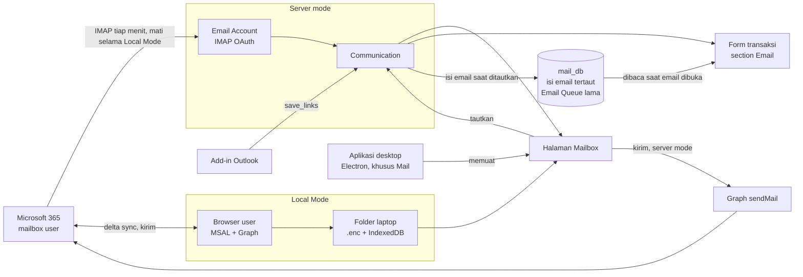

# Mail ERPNext Binding Microsoft 365 - Flow and Settings

Referensi lengkap Mailbox di app `erpnext_custom`, salinan dokumen Claude Docs "Mail ERPNext Binding Microsoft 365 - Flow and Settings". Per 2026-10-01, ditambah IMAP, Filter, dan Important 2026-10-02. Panduan alur dan setelan untuk admin (semua fitur email, termasuk agent dan Orchestrator): [README_EMAIL.md](README_EMAIL.md).

Mailbox ERPNext membaca, mengirim, dan menautkan email Microsoft 365 ke transaksi ERP untuk 50+ user, tanpa menimbun email di server. Email dibaca browser tiap user langsung dari Microsoft (Local Mode), server tidak menarik email (incoming dikunci), dan isi email yang ditautkan disimpan di database terpisah `mail_db`. Ada aplikasi Windows "Cakra ERP" (Electron, tray seperti Outlook) yang khusus untuk Mail.

**Untuk AI yang membaca ini:** baca berurutan, lalu bangun per langkah di "Langkah replikasi dari nol" dan jalankan tesnya sebelum lanjut. Kode acuan ada di repo `erp_cakra` (app `erpnext_custom`, path di bagian Peta kode relatif ke paket `erpnext_custom/erpnext_custom/`); salinan teks ini ada di `erpnext_custom/MAILBOX_REFERENCE.md`. Jangan menaruh Client ID, Tenant ID, secret, password root, atau kunci di kode: semuanya diisi lewat desk atau file konfigurasi server dan tidak masuk git.

## Daftar isi

1. [Kebutuhan](#kebutuhan)
2. [Arsitektur](#arsitektur)
3. [Setelan Microsoft Entra (Azure)](#setelan-microsoft-entra-azure)
4. [Setelan ERPNext](#setelan-erpnext)
5. [Peta kode](#peta-kode)
6. [Server mode](#server-mode)
7. [Local Mode](#local-mode)
8. [Enkripsi, kunci, dan reset](#enkripsi-kunci-dan-reset)
9. [Tautan email ke transaksi](#tautan-email-ke-transaksi)
10. [Server tidak menyimpan email: kunci incoming dan mail_db](#server-tidak-menyimpan-email-kunci-incoming-dan-mail_db)
11. [Spesifikasi tampilan](#spesifikasi-tampilan)
12. [Signature perusahaan](#signature-perusahaan)
13. [Aplikasi desktop Windows](#aplikasi-desktop-windows)
14. [Gotcha](#gotcha)
15. [Langkah replikasi dari nol](#langkah-replikasi-dari-nol)
16. [Pasang di server lain (prod)](#pasang-di-server-lain-prod)
17. [Cara uji dan status](#cara-uji-dan-status)

## Kebutuhan

Semua kebutuhan datang dari pemilik sistem (perusahaan ekspedisi, 50+ user, Microsoft 365). Kolom kanan adalah keputusan yang sudah dibangun; ikuti keputusan itu kalau meniru.

| Kebutuhan | Keputusan |
| --- | --- |
| Kirim dan terima email Microsoft 365 dari ERPNext | Terima lewat IMAP OAuth (Connected App). Kirim lewat Microsoft Graph `sendMail`, karena tenant memblokir SMTP AUTH. |
| Semua folder Outlook ikut, termasuk Sent Items | Tarik per folder IMAP. Folder bertanda Sent dicatat sebagai email Terkirim. |
| Tampilan seperti Outlook web | Halaman desk `/desk/mailbox`: daftar di kiri, isi di kanan. Folder ada di sidebar kiri desk. |
| Menu Inbox dan Sent membuka Mailbox, bukan list Communication | Item sidebar menu Mail = Page `mailbox` dengan `?folder=Inbox` atau `?folder=Sent`. |
| Filter tanggal, rentang maksimal 1 bulan, plus urutan dan saringan lain | Satu tombol Filter di baris judul: Date (maks 1 bulan, dipotong dengan pesan) \| Sort (Newest/Oldest first), lalu Unread Only \| Linked Only \| With Attachments \| Important Only. |
| Email terbaru langsung terbuka | Buka otomatis email paling atas saat folder dibuka, tanpa menandainya dibaca. |
| Tautkan email ke nomor transaksi, boleh lebih dari satu | Modal Link to Transaction: 5 Packing List terbaru, cari di semua modul, ledger dan log tidak bisa dicari. |
| Balasan di percakapan yang sama ikut tertaut | Tautan berlaku untuk seluruh percakapan; email baru mewarisi tautan percakapannya. |
| Email tertaut tampil di form transaksi | Section Email sendiri di atas Comments, disembunyikan dari Activity, tidak tampil di tab Assistant. |
| Notifikasi email baru | Notification Log tipe Alert, lonceng + toast. Server mode dari tarikan IMAP; Local Mode dilaporkan browser (`notify_local_mail`). |
| Mailbox untuk semua user | Halaman Mailbox (Inbox/Sent/Settings) terbuka untuk semua user desk (role bawaan Desk User), tanpa role khusus. |
| Siapa boleh menautkan email | Siapa pun yang boleh membaca transaksinya. Izin tulis Communication tidak dipakai. |
| 50+ user, sekitar 50 GB email, server jangan penuh | Local Mode: email diambil browser langsung dari Microsoft dan disimpan di laptop user. Server hanya menyimpan email yang ditautkan. |
| User memilih folder laptop dan folder Outlook yang disimpan | Folder laptop lewat File System Access API; folder Outlook dipilih di Settings. |
| Batas simpan di laptop | Bawaan admin 30 hari; tiap user boleh memilih 30/60/90/180 hari di Settings. Email lebih lama dicari dan dibaca langsung dari Microsoft, tanpa mengunduh seluruh mailbox. |
| Folder email di laptop dikunci | AES-256-GCM, kunci per user dipegang server. Ekspor kunci satuan dan massal + alat dekripsi offline. |
| Reset kalau user salah email | Reset otomatis saat email User berganti + tombol Reset Mailbox. |
| Composer rapi | Baris From \| To \| CC lalu Subject \| CC (CC satu blok), lampiran dan transaksi berdampingan dan bergulir ke samping, tombol ikon, Discard dan Send di baris judul (hanya selama menulis). |
| Lampiran seperti Outlook | Tile: ikon jenis file, nama di bawahnya, maksimal 2 baris. |
| Bahasa UI | Semua teks Mailbox bahasa Inggris. Tombol tarik bernama Sync. |
| Signature perusahaan seragam | Template Jinja + Signature Builder drag and drop, termasuk baris teks di atas signature ("Regards,"). Alamat dan telepon dari master Branch, HP dari profil User. |
| Mode laptop diatur admin | Centang Local Mode di ERPNext Custom Setting, berlaku untuk semua user. |
| Server tidak boleh menyalin email | Selama Local Mode ON: Enable Incoming di Email Account mana pun ditolak saat Save, dan semua jalur tarik IMAP mengembalikan kosong. Outgoing tetap boleh. |
| Database utama tidak membesar karena email | Database terpisah `mail_db`: isi lengkap email tertaut (header tetap di `erp_db`) dan Email Queue yang sudah lewat. Dibuat otomatis saat install/migrate. |
| Email Queue dibersihkan otomatis | Tiap hari dipindah ke `mail_db` lalu dihapus dari `erp_db`: Sent/Error sesudah 1 hari, Not Sent/Sending sesudah 3 hari. Angka diatur admin. |
| Email tertahan diberitahu | Not Sent/Sending lebih dari 30 menit = notifikasi lonceng ke System Manager, sekali per email. |
| Daftar email menunjukkan transaksinya | Baris ke-4 tiap email di daftar = badge nomor transaksi tertaut, maksimal 4 baris per email. |
| Tandai email penting | Bintang di tiap baris daftar = flag Outlook / `\Flagged` IMAP / `cmi_important` (Server mode). |
| Menu Setting email hanya admin | Bagian Setting sidebar Mail (Email Account, Email Domain, Email Queue, Notification Settings) hanya untuk System Manager. |
| Mail dari Frappe CRM | Tombol Mail di sidebar CRM, di atas Manual Book; membuka `/desk/mailbox` di tab baru. Tombol Help CRM dihapus. |
| Aplikasi Windows seperti Outlook | Aplikasi desktop "Cakra ERP" (Electron): tray, terbuka saat login Windows, popup notifikasi Windows, update otomatis. Khusus Mail: halaman ERP lain dibuka di browser web, ada tombol Back to Mail. |

## Arsitektur

Satu halaman Mailbox, dua sumber data. Admin memilih lewat centang Local Mode; kedua mode memakai tampilan, composer, dan modal tautan yang sama. Produksi memakai Local Mode; Server mode tetap ada di kode tapi tarikannya dikunci selama Local Mode ON.


```mermaid
flowchart LR
  M365[Microsoft 365<br/>mailbox user]
  subgraph Server mode
    EA[Email Account<br/>IMAP OAuth]
    COM[Communication]
  end
  subgraph Local Mode
    BR[Browser user<br/>MSAL + Graph]
    LAP[Folder laptop<br/>.enc + IndexedDB]
  end
  PAGE[Halaman Mailbox]
  GRAPH[Graph sendMail]
  TRX[Form transaksi<br/>section Email]
  ADDIN[Add-in Outlook]
  MAILDB[(mail_db<br/>isi email tertaut<br/>Email Queue lama)]
  APP[Aplikasi desktop<br/>Electron, khusus Mail]
  M365 -->|IMAP tiap menit, mati selama Local Mode| EA --> COM --> PAGE
  PAGE -->|kirim, server mode| GRAPH --> M365
  M365 <-->|delta sync, kirim| BR
  BR --> LAP
  LAP --> PAGE
  PAGE -->|tautkan| COM
  ADDIN -->|save_links| COM
  COM --> TRX
  COM -->|isi email saat ditautkan| MAILDB
  MAILDB -->|dibaca saat email dibuka| TRX
  APP -->|memuat| PAGE
```

Panah ke Communication hanya terjadi untuk email yang ditautkan (Local Mode dan add-in) atau semua email (Server mode).

- **Server mode.** Email Account menarik IMAP tiap menit ke doctype `Communication`. Halaman Mailbox membaca Communication. Kirim lewat alur bawaan Frappe (Email Queue), lalu hook `override_email_send` meneruskannya ke Graph. Cocok untuk satu atau beberapa mailbox bersama.
- **Local Mode.** Browser tiap user login ke Microsoft (MSAL, aplikasi SPA) dan memanggil Graph langsung: sinkron delta, baca, kirim, rule. Email disimpan terenkripsi di folder laptop pilihan user; indeks di IndexedDB. Server tidak menyimpan email kecuali yang ditautkan. Ini mode untuk 50+ user.
- **Pola kode.** `class LocalMailbox extends Mailbox` hanya mengganti sumber data: `fetch_rows`, `fetch_doc`, `persist_seen`, `fetch_links`, `save_links`, `deliver`, `load_attachments`, `link_key`, `list_links_args`. Semua tampilan tetap milik `Mailbox`.
- **Tautan ke transaksi.** Selalu lewat Communication: `reference_doctype/name` + tabel `timeline_links` (Communication Link). Form transaksi membaca tautan itu untuk section Email.
- **Add-in Outlook** (prototipe) memakai endpoint yang sama dengan Local Mode (`outlook_addin.lookup`, `save_links`).
- **mail_db.** Database MariaDB kedua di server yang sama. Communication email tertaut tinggal header + cuplikan di `erp_db`; isi lengkapnya di `mail_db.communication_content`. Email Queue lama pindah utuh ke sana. Lihat bagian Server tidak menyimpan email.
- **Aplikasi desktop.** Jendela Electron yang memuat `/desk/mailbox` dari server (bukan salinan ERP). Halaman lain dibuka di browser web. Lihat bagian Aplikasi desktop Windows.

## Setelan Microsoft Entra (Azure)

Satu app registration (single tenant) melayani kedua mode. Admin tenant cukup mengaturnya sekali.

1. **App registration** baru, akun di tenant ini saja. Catat Application (client) ID dan Directory (tenant) ID.
2. **Platform Web** (untuk Server mode, dipakai Connected App Frappe). Redirect URI persis: `https://<domain ERP>/api/method/frappe.integrations.doctype.connected_app.connected_app.callback/<nama Connected App>`. Buat **client secret** di Certificates & secrets. Azure hanya menerima `http://` untuk `localhost`.
3. **Platform Single-page application** (untuk Local Mode). Redirect URI persis: `https://<domain ERP>/assets/erpnext_custom/mailbox_auth.html`. Jangan didaftarkan di platform Web.
4. **API permissions, Delegated**, lalu **Grant admin consent** supaya user tidak ditanya satu per satu:

| Izin | Dipakai oleh |
| --- | --- |
| `offline_access` | Server mode (refresh token) |
| Office 365 Exchange Online `IMAP.AccessAsUser.All` | Server mode, tarik IMAP |
| Office 365 Exchange Online `SMTP.Send` | Server mode (diminta Connected App; kirimnya tetap lewat Graph) |
| Microsoft Graph `Mail.Send` | Server mode (token Graph dari refresh token yang sama) dan Local Mode |
| Microsoft Graph `Mail.ReadWrite` | Local Mode: sinkron, tandai dibaca, draf |
| Microsoft Graph `User.Read` | Local Mode: cek akun yang login = email User ERP |
| Microsoft Graph `MailboxSettings.ReadWrite` | Local Mode tab Rule (opsional, diminta terpisah) |

5. **Mailbox**: IMAP harus aktif untuk mailbox Server mode. SMTP AUTH boleh tetap mati; sistem ini tidak memakainya.

Pesan galat yang sudah ditemui dan artinya:

| Kode | Arti | Perbaikan |
| --- | --- | --- |
| AADSTS700016 | Client ID salah (pernah terisi nilai secret) | Tempel Application (client) ID, bukan secret |
| AADSTS50011 | Redirect URI tidak cocok persis | Samakan dengan `redirect_uri` di Connected App, termasuk http/https dan host |
| AADSTS9002326 | Redirect SPA terdaftar di platform Web | Pindahkan ke platform Single-page application |
| SMTP 535 5.7.139 | SMTP AUTH dimatikan tenant | Kirim lewat Graph (lihat Server mode) |

## Setelan ERPNext

Stack: Frappe/ERPNext v16 di Docker, app kustom `erpnext_custom`. Setelan di bawah diisi lewat desk atau file konfigurasi server; field kustomnya dibuat kode di `after_migrate` (lihat Peta kode).

**Wajib untuk kedua mode**

| Tempat | Isian |
| --- | --- |
| `site_config.json` | `host_name` = alamat publik ERP persis (dipakai membentuk redirect URI Connected App) |
| Scheduler | Aktif (`bench enable-scheduler`); antrean email, arsip mail_db, dan notifikasi bergantung padanya |
| User | Email User = alamat mailbox Microsoft-nya. `branch` (Link ke CMI Office), `cmi_job_title` (Job Title), `mobile_no` untuk signature |
| Branch | `address` (Small Text, satu baris per baris alamat) dan `cmi_phone`. Nama Branch sama dengan nama CMI Office |
| Menu desk Mail | Item Inbox = Page `mailbox` + route_options `{"folder": "Inbox"}`, Sent = `{"folder": "Sent"}`; dibangun `desk_menu.ensure_menus()` dari `desk_menus_spec.py`. Section Setting (Email Account, Email Domain, Email Queue, Notification Settings) hanya tampil untuk System Manager |

**Server mode** (hanya kalau Local Mode mati)

| Tempat | Isian |
| --- | --- |
| Connected App | Provider Microsoft; Client ID + Client Secret (platform Web); Authorization URI `https://login.microsoftonline.com/<tenant>/oauth2/v2.0/authorize`; Token URI `.../oauth2/v2.0/token`; scope `offline_access`, `https://outlook.office.com/IMAP.AccessAsUser.All`, `https://outlook.office.com/SMTP.Send`. Klik Connect sebagai pemilik mailbox (menghasilkan Token Cache) |
| Email Account | Auth Method OAuth + Connected App di atas; IMAP `outlook.office365.com:993` SSL; Enable Incoming; Email Sync Option `ALL`; Enable Outgoing + Default Outgoing; custom field `cmi_graph_connected_app` = Connected App yang sama (artinya: kirim lewat Graph) |
| Tabel IMAP Folder | `INBOX`, folder kustom yang mau ditarik, dan `Sent Items` dengan centang `cmi_is_sent` (Folder Terkirim) |
| User Email | Baris di User untuk setiap user yang membuka mailbox itu. Frappe hanya membuatnya otomatis kalau email User sama persis dengan email_id akun |

**Local Mode** (ERPNext Custom Setting, tab Mailbox)

| Field | Isi |
| --- | --- |
| `mailbox_local_mode` | Centang = semua user memakai Local Mode, dan Enable Incoming semua Email Account dikunci |
| `mailbox_client_id`, `mailbox_tenant_id` | ID app registration yang punya platform SPA |
| `mailbox_keep_days` | Hari email disimpan di laptop, bawaan 30, 0 = semua (user boleh memilih 30/60/90/180 sendiri) |
| `mailbox_sync_seconds` | Interval sinkron otomatis, bawaan 60, minimal 15 |
| `mailbox_signature_company`, `mailbox_signature_layout`, `mailbox_signature_template` | Signature perusahaan (lihat bagian Signature) |
| `mail_queue_done_days` | Bagian Email Archive (mail_db): Email Queue Sent/Error dipindah sesudah N hari, bawaan 1, 0 = tidak |
| `mail_queue_pending_days` | Not Sent/Sending/Partially Sent dipindah sesudah N hari, bawaan 3, 0 = tidak |
| `mail_queue_alert_minutes` | Notifikasi ke System Manager kalau email belum terkirim sesudah N menit, bawaan 30, 0 = mati |

**Server** (sekali per server, tidak masuk git)

| Tempat | Isian |
| --- | --- |
| `sites/common_site_config.json` | `mariadb_root_password` = password root MariaDB. Dipakai migrate untuk membuat database `mail_db` dan `fleet_db` beserta GRANT-nya. Tanpa ini: GRANT manual sekali |
| `site_config.json` (opsional) | `mail_db` = nama database arsip kalau satu MariaDB dipakai beberapa site (bawaan `mail_db`) |
| Email Account | Enable Incoming dimatikan (dikunci selama Local Mode). Enable Outgoing tetap untuk kiriman ERP |

Hak akses:

- Halaman Mailbox (menu Inbox/Sent, Settings) terbuka untuk semua user desk: `page/mailbox/mailbox.json` berisi role bawaan **Desk User** yang dimiliki setiap System User di v16. Tombol Mail di Frappe CRM juga tampil untuk semua user. Settings hanya mengubah milik user itu sendiri.
- Menautkan dan melepas tautan: siapa pun yang boleh membaca transaksinya (lihat Tautan email ke transaksi). `get_links` dan `list_links` hanya mengembalikan transaksi yang boleh dibaca user.
- Export Mailbox Key hanya System Manager.
- Bagian **Setting** di sidebar Mail dibuang dari boot user selain Administrator/System Manager (`mail_inbox.boot`, `extend_bootinfo`). Frappe selalu menampilkan judul Section Break dan Notification Settings terbaca semua user, jadi bagian itu dibuang utuh.
- Enable Incoming Email Account: ditolak saat Save selama Local Mode ON (`CMIEmailAccount.validate`).

## Peta kode

Path relatif ke `erpnext_custom/erpnext_custom/` kecuali disebut lain. Tidak ada perubahan di Frappe atau ERPNext inti; perilaku bawaan diubah lewat hook.

| File | Isi penting |
| --- | --- |
| `mail_inbox.py` | Server mode dan tautan. `CMIInboundMail` (catat `imap_folder`, Sent = Terkirim), `get_inbound_mails` + `sync_rule` + `_fetch` (tarik per folder; `[]` selama Local Mode), `pull_often`, `pull_now`, `mailbox_state`, `notify_new_mail`, `conversation`, `get_links`, `list_links` (tautan satu halaman daftar sekaligus), `link_transaction` / `unlink_transaction` (memanggil `move_content`), `inherit_conversation_links`, `linked_emails` / `linked_email` (isi dari mail_db), `boot` (sidebar Setting hanya admin), `backfill`, `trim_file_name`, custom field `MAIL_FIELDS` |
| `graph_mail.py` | `CMIEmailAccount` (override doctype Email Account; `validate` menolak Enable Incoming selama Local Mode), `send` (hook `override_email_send`), `_graph_token` (tukar refresh token ke token Graph), custom field `GRAPH_FIELDS` |
| `mail_archive.py` | Database `mail_db`: `ensure` (tabel + pemindahan awal), `move_content` / `_restore` / `content_of` / `fill_content` (isi email tertaut), `archive_queue` (Email Queue harian), `alert_stuck` (notifikasi antrean tertahan), `backup` |
| `extra_db.py` | `ensure(name)`: buat database tambahan sebagai user site, kalau ditolak lewat root MariaDB + GRANT. Dipakai `mail_db` dan `fleet_db` (app `erp`, `erp/erp/install.py` `_ensure_fleet_db`) |
| `mailbox_imap.py` | Local Mode lewat IMAP: server meneruskan IMAP/SMTP atas nama user yang login, isi tidak disimpan |
| `outlook_addin.py` | Endpoint Local Mode dan add-in: `mailbox_config`, `mailbox_key`, `export_mailbox_key`, `export_mailbox_keys`, `notify_local_mail`, `lookup`, `save_links`, `_import` |
| `quick_search.py` | Pencarian nomor transaksi: `find_transactions`, `transaction_doctypes` (tanpa ledger/log), `latest_transactions` (5 Packing List terbaru) |
| `erpnext_custom/page/mailbox/mailbox.js` + `mailbox.json` | Halaman Mailbox: `class Mailbox` (tampilan, composer, modal tautan, sidebar, filter) dan `class LocalMailbox extends Mailbox` (sumber data Local Mode, Settings 3 tab). Page role = Desk User |
| `public/js/mailbox_local.js` | Mesin Local Mode `LocalMail`: MSAL, Graph, sinkron delta, file laptop, IndexedDB, enkripsi, reset, `set_days`, `older`. Dimuat di semua halaman desk |
| `public/mailbox_auth.html` | Redirect URI SPA untuk login MSAL |
| `public/mailbox_decrypt.html` | Alat dekripsi offline, satu file tanpa library luar |
| `public/vendor/` | `msal-browser` 5.23.0 dan `postal-mime` 3.0.0, di-vendor (MSAL melarang dari CDN) |
| `public/js/linked_mail.js` | Section Email di form transaksi (event `form-refresh`) |
| `public/js/notification_badge.js` | Lonceng + toast (polling) + popup Windows di aplikasi desktop |
| `public/js/sidebar_footer.js` | Tombol Mail dan Assistant di kiri bawah sidebar desk, tombol Access on Device di menu Mail, dan semua perilaku khusus aplikasi desktop: tombol Display, menu judul tanpa Desktop/Workspaces/Website, cegat `frappe.router.push_state`, tombol Back to Mail |
| `public/js/user.js`, `public/js/user_list.js` | Tombol Export Mailbox Key (form User) dan menu Export Mailbox Keys (daftar User) |
| `erpnext_custom/doctype/mailbox_signature/` | Doctype Mailbox Signature, `signature_context`, `company_signature`, `SIGNATURE_FIELDS` (User `cmi_job_title`, Branch `cmi_phone`) |
| `public/js/signature_builder.js` | Signature Builder drag and drop di ERPNext Custom Setting |
| `erpnext_custom/doctype/erpnext_custom_setting/` | Tab Mailbox: Local Mode, ID Microsoft, keep days, sync, signature, Email Archive (mail_db) |
| `public/outlook/` | Add-in Outlook (prototipe): `manifest.xml`, `taskpane.html`, `taskpane.js` |
| `desk_menus_spec.py`, `desk_menu.py` | Menu Mail di sidebar desk |
| `install.py` | `after_install` memanggil `after_migrate`: `create_custom_fields` untuk semua field di atas, urutan field Branch (`BRANCH_LAYOUT_LEAD`), `mail_archive.ensure()` |
| `test_mailbox.py`, `test_mail_folders.py`, `test_graph_mail.py`, `test_mailbox_local.js` | Tes (lihat Cara uji) |
| `erpnext_custom/desktop/` (di luar paket Python) | Aplikasi Windows Electron: `main.js`, `preload.js`, `package.json`, `README.md` (build dan deploy) |
| `crm_cakra/frontend/src/components/Layouts/AppSidebar.vue` (app CRM) | Tombol Mail di sidebar CRM (di atas Manual Book), `window.open('/desk/mailbox', '_blank', 'noopener')`; Help dihapus. Butuh `yarn build` CRM |

Hook di `hooks.py`:

```python
override_doctype_class = {"Email Account": "erpnext_custom.graph_mail.CMIEmailAccount"}
override_email_send = "erpnext_custom.graph_mail.send"
extend_bootinfo = ["erpnext_custom.mail_inbox.boot"]  # Setting sidebar Mail hanya System Manager
scheduler_events = {
    "cron": {
        "* * * * *": ["erpnext_custom.mail_inbox.pull_often"],       # kosong selama Local Mode
        "*/5 * * * *": ["erpnext_custom.mail_archive.alert_stuck"],  # Email Queue tertahan
    },
    "daily": ["erpnext_custom.mail_archive.archive_queue"],           # Email Queue -> mail_db
}
doc_events = {
    "File": {"before_insert": "erpnext_custom.mail_inbox.trim_file_name"},
    "Communication": {
        "after_insert": "erpnext_custom.mail_inbox.inherit_conversation_links",
        "onload": "erpnext_custom.mail_archive.fill_content",        # isi dari mail_db
    },
}
app_include_js = [
    "/assets/erpnext_custom/js/notification_badge.js?v=13",
    "/assets/erpnext_custom/js/sidebar_footer.js?v=9",
    "/assets/erpnext_custom/js/linked_mail.js?v=6",
    "/assets/erpnext_custom/js/mailbox_local.js?v=11",
]
doctype_js = {"User": "public/js/user.js"}
doctype_list_js = {"User": "public/js/user_list.js"}
after_install = "erpnext_custom.install.after_install"  # memanggil after_migrate
after_migrate = "erpnext_custom.install.after_migrate"
```

Naikkan `?v=` setiap file di `app_include_js` berubah: nginx menyajikan `/assets` tanpa Cache-Control, jadi browser memakai salinan lama.

## Server mode

Email ditarik server ke `Communication` tiap menit dan dikirim lewat Graph. Tiga bagian bawaan Frappe harus diganti karena rusak untuk banyak folder dan tenant tanpa SMTP AUTH.

Produksi memakai Local Mode, jadi tarikan di bagian ini **mati**: selama `mailbox_local_mode` ON, `mail_inbox.get_inbound_mails` langsung mengembalikan `[]` dan Enable Incoming tidak bisa disimpan. Kirim lewat Graph (di bawah) tetap dipakai untuk email yang dikirim ERP.

**Tarik IMAP per folder** (`CMIEmailAccount.get_inbound_mails` -> `mail_inbox.get_inbound_mails`)

- Mode `ALL` bawaan memakai UID tertinggi seluruh akun untuk semua folder dan aturan satu folder bocor ke folder lain. Pengganti: loop per folder, titik awal dihitung dari UID tertinggi folder itu sendiri (`sync_rule` -> `UID N:*`).
- Folder yang baru didaftarkan mulai dari ujungnya (`UIDNEXT`), bukan dari surat pertama. Surat lama masuk lewat `backfill()` yang senyap.
- `_seed_uidvalidity` menyimpan UIDVALIDITY per folder dan mengenali folder `\Sent` lewat perintah LIST.
- Server IMAP menjawab `UID N:*` dengan surat terakhir walau tidak ada surat baru (RFC 3501). `_fetch` membuang UID di bawah titik awal. Dulu satu tarikan kosong makan 21 detik, sekarang 5 detik.
- `frappe.db.commit()` per folder, supaya satu folder gagal tidak membatalkan yang lain.
- `CMIInboundMail` mencatat `Communication.imap_folder`, memindah folder kalau surat dipindah di Outlook, dan mencatat surat dari folder Sent sebagai `sent_or_received = Sent`, `seen = 1`. Kiriman ERP yang sama dikenali lewat Message-ID supaya tidak dobel.
- Hook `File.before_insert` (`trim_file_name`) memotong nama lampiran jadi 140 karakter. Nama lebih panjang menggagalkan satu batch tarikan.

**Jadwal dan tombol Sync**

- Cron tiap menit `pull_often`; bawaan Frappe cuma tiap 10 menit.
- Tombol Sync (`pull_now`) memakai nama job yang sama dengan tarikan terjadwal, `pull_from_email_account|<akun>`. Nama berbeda membuat dua tarikan saling menunggu kunci baris Email Account.
- Halaman memantau hasil lewat polling `mailbox_state` (bukan `frappe.realtime`, yang di desk ini diam-diam tidak terpasang).

**Kirim lewat Graph** (`graph_mail.send`, hook `override_email_send`)

- Composer memanggil `frappe.core.doctype.communication.email.make`; Frappe membuat Email Queue seperti biasa.
- `send()` memeriksa `cmi_graph_connected_app` di Email Account. Terisi: MIME utuh (base64) di-POST ke `/me/sendMail`, batas 4 MB, Bcc ditambahkan ke header, satu kirim per antrean. Kosong: jatuh ke SMTP bawaan.
- Token Graph didapat dengan menukar refresh token Connected App IMAP ke scope `offline_access https://graph.microsoft.com/Mail.Send` (refresh token Microsoft tidak terikat resource). Token disimpan di `frappe.cache`.
- **Jangan pernah `save()` Token Cache.** Kedaluwarsa token dihitung dari `modified + expires_in`; menyimpan ulang memalsukan umurnya dan IMAP gagal AUTHENTICATE.
- `CMIEmailAccount.validate_smtp_conn` dilewati untuk akun Graph.

**Notifikasi**

`CMIEmailAccount.receive` mengumpulkan surat baru; `notify_new_mail` membuat Notification Log tipe Alert untuk setiap user yang punya baris User Email akun itu, dengan link `/desk/mailbox?open=<Communication>`. Frappe tidak pernah mengirim email untuk Notification Log tipe Alert, jadi tidak ada lingkaran. `notification_badge.js` menggambar angka lonceng dan toast lewat polling.

## Local Mode

Browser tiap user menjadi klien Microsoft Graph; server ERP hanya memberi setelan, kunci, dan menyimpan email yang ditautkan. Semua ada di `public/js/mailbox_local.js` (`class LocalMail`). Browser yang didukung: Edge dan Chrome (File System Access API), juga aplikasi desktop (Electron = Chromium). Butuh https (kecuali localhost).

**Siklus hidup**

1. `LocalMail.shared()` membuat satu mesin per tab dari `outlook_addin.mailbox_config` (client_id kosong = Local Mode mati). File ini ada di `app_include_js`, jadi sinkron otomatis jalan di halaman desk mana pun, tapi hanya kalau penanda localStorage `erp-mailbox-ready|<user>` ada (dipasang saat Mailbox berhasil tersambung).
2. `init()`: buka IndexedDB `erp-mailbox|<user ERP>` (store `messages` dengan index `folder_date`, `folder_seen`, `imid`, `pending`; store `kv`), ambil kunci enkripsi, cek email mailbox berganti, baca kv `keep_days`, siapkan MSAL (`PublicClientApplication`, authority `https://login.microsoftonline.com/<tenant>`, redirect `mailbox_auth.html`, cache `localStorage`), buka folder laptop.
3. `login()`: `loginPopup` dengan scope `Mail.ReadWrite`, `Mail.Send`, `User.Read` dan `loginHint` = email User. Sesudah login, `/me` dicek: alamatnya harus sama dengan email User ERP, kalau tidak cache dibersihkan dan login ditolak.
4. `token()`: `acquireTokenSilent`. Gagal = `NeedAction("login")`; refresh token SPA berumur 24 jam, jadi user sesekali klik Sign in lagi. Email di laptop tetap terbaca.
5. `graph()`: header `Prefer: IdType="ImmutableId"` (id tetap walau email dipindah folder), ulang otomatis untuk 429/503/504 memakai `Retry-After`.

**Folder laptop**

- `showDirectoryPicker({id: "erp-mailbox", mode: "readwrite"})`; handle disimpan di kv `root`. Izin berlaku per sesi browser; halaman meminta ulang dengan satu klik. Browser tanpa picker jatuh ke OPFS (`navigator.storage.getDirectory()`).
- Susunan: `<folder pilihan>/<email mailbox>/<folder Outlook>/<yyyy-mm>/<yyyymmdd-hhmm> <tanda>.enc`, tanda = 8 karakter pertama SHA-1 id Graph. Jalur disimpan relatif, jadi folder yang dipindah user cukup dipilih ulang.

**Sinkron**

- Satu tab saja yang menyinkron: `navigator.locks.request("erp-mailbox-sync|<mailbox>", {ifAvailable: true})`.
- Per folder Outlook yang dipilih: delta query `/me/mailFolders/{id}/messages/delta?$select=...&$filter=receivedDateTime ge <batas>&$orderby=receivedDateTime desc`, `Prefer: odata.maxpagesize=100`. Titik lanjut disimpan tiap halaman sebagai `{link, days}`; 410 (delta kedaluwarsa) = ulang dari awal.
- `apply()`: `@removed` menghapus baris dan file (kalau masih di folder itu), email pindah folder = file ikut dipindah, lainnya digabung ke baris indeks dan diantrekan unduh (`pending` = tanggal, terbaru dulu).
- `download_pending()`: kunci `erp-mailbox-download|<mailbox>`, jalankan `migrate()` dulu, lalu 3 pekerja paralel (Graph menolak lebih dari 4 permintaan serentak per mailbox) mengunduh `/me/messages/{id}/$value` ke file terenkripsi.
- `list({folder, search, dates, start, limit, order, unread, attachments})`: kursor index `folder_date` maju/mundur sesuai `order`, saringan `seen`/`has_att` di kolom terbuka; baris yang dikembalikan membawa `message_id` (dipakai `list_links`).
- Rentang simpan: bawaan `mailbox_keep_days` (admin), user boleh memilih 30/60/90/180 hari di Settings > Local Email (`set_days`, disimpan kv `keep_days` per browser; sama dengan bawaan = ikut admin lagi). Ganti rentang = titik sinkron diulang dengan batas baru.
- Mencari: selain indeks laptop, email di luar rentang ikut dicari otomatis di Microsoft lewat Graph `$search` di folder itu (hanya yang cocok, 50 per halaman; halaman berikutnya lewat tombol), bukan mengunduh seluruh mailbox. Satu permintaan sekaligus (`older_loading`); gagal = tidak diulang otomatis.
- `prune()` tiap sinkron menghapus baris dan file yang lebih tua dari rentang simpan, termasuk folder bulan yang kosong. Email lebih lama dibaca langsung dari Graph lewat `older()` (tombol "Show email older than N days").
- Sinkron otomatis tiap `mailbox_sync_seconds` (minimal 15). Tab yang tidak terlihat dibatasi browser sendiri sekitar sekali semenit (aplikasi desktop memakai `backgroundThrottling: false`).
- **Notifikasi email masuk.** Server tidak melihat email Local Mode, jadi `notify_new_mail` tidak jalan. Sebagai gantinya `apply()` mengumpulkan baris BARU yang belum dibaca di folder berjenis `inbox`, hanya kalau folder itu disinkron dari delta lanjutan (`this.collect`; sinkron awal dan ulang-dari-awal sengaja diam supaya email lama tidak membanjiri). Sesudah sinkron, `notify_fresh()` mengirim maksimal 20 email yang umurnya di bawah sehari ke `outlook_addin.notify_local_mail`, yang membuat Notification Log untuk user yang login saja: subjek "New email from \<pengirim>: \<subjek>" (di-escape), link `/desk/mailbox?message_id=<Message-ID>`. Lonceng, toast, dan popup Windows aplikasi desktop lalu jalan lewat `notification_badge.js`. Yang dikirim ke server hanya pengirim, subjek, dan Message-ID.

**Baca dan kirim**

- `get(id)`: file didekripsi, di-parse `postal-mime`; gambar `cid:` jadi data URL (iframe baca ber-sandbox tidak bisa memuat blob URL), lampiran jadi blob URL.
- `send()`: buat draf (`createReply`, `createReplyAll`, `createForward`, atau pesan baru), PATCH subjek/isi/penerima, lampiran (sampai 3 MB langsung, di atasnya upload session per potongan 12 x 320 KiB), gambar tempel dan signature jadi lampiran inline `cid:`, lalu `/send`. Draf dipakai supaya balasan membawa header utas Outlook. Kirim tanpa transaksi tertaut tidak menyimpan apa pun di server.
- Tab Rule di Settings mengelola rule Outlook asli lewat `/me/mailFolders/inbox/messageRules` dengan scope terpisah `MailboxSettings.ReadWrite`.

**Menautkan dari Local Mode**

Email belum ada di server. `save_links(mailbox, message_id, links, eml_b64)` mengirim .eml utuh; server mengimpornya lewat `CMIInboundMail` (jalur yang sama dengan tarikan IMAP, flag `cmi_mail_backfill` supaya tidak memicu notifikasi) lalu menautkannya, dan isi lengkapnya langsung pindah ke `mail_db` di transaksi yang sama. Satu Message-ID = satu Communication di seluruh sistem.

**Filter dan Important** (2026-10-02)

- Tombol Filter: Date | Sort, lalu centang Unread Only | Linked Only | With Attachments | Important Only.
- Important (bintang di baris daftar, klik tanpa membuka email) = tanda di sumbernya: flag Outlook (`flag.flagStatus`, ikut tampil di Outlook), `\Flagged` IMAP, Server mode custom field Communication `cmi_important` (`mail_inbox.set_important`). Kolom indeks `flagged` tidak dienkripsi. `FIELDS` Graph ditambah `flag`; `DELTA_VERSION` membuat delta diulang sekali dari awal supaya kolom baru terisi.
- Linked Only: `mail_inbox.linked_mail` memberi Message-ID email mailbox itu yang punya tautan transaksi (Local Mode, dicocokkan ke hash imid indeks) atau nama Communication (Server mode).
- Nomor transaksi tertaut tampil sebagai badge (`.mbx-link-badge`).
- `_can_read` membisukan pesan: `has_permission(doc=...)` yang gagal memunculkan pop-up "does not have doctype access" untuk tautan ke transaksi yang tak boleh dibaca user.

**Local Mode lewat IMAP** (mailbox di luar Microsoft 365: cPanel, GoDaddy, dll)

- Setelan: ERPNext Custom Setting > Mailbox > section IMAP (Enable IMAP, IMAP Server/Port/SSL, SMTP Server/Port/Security), satu untuk semua user, hanya tampil kalau Local Mode ON. Login = email User; tiap user memasukkan password emailnya sendiri di Mailbox (dialog Connect IMAP), disimpan di `__Auth` (`User` / `cmi_mailbox_imap_password`).
- Browser tidak bisa IMAP, jadi server meneruskan (`mailbox_imap.py`: `connect`, `disconnect`, `folders`, `state`, `headers`, `raw`, `mark_read`, `older`, `find`, `send`) tanpa menyimpan isi. Galat wajar dikembalikan `{"error", "need": "login" | "missing": 1}`, bukan dilempar (sinkron otomatis tiap menit tidak memunculkan pop-up).
- Mesin `ImapMail extends LocalMail` (indeks, enkripsi, rentang simpan, sinkron otomatis sama). Id = `<uidvalidity>:<uid>:<folder>`; sinkron = server memberi semua `[uid, seen]` dalam rentang, dicocokkan dengan indeks (baru diminta per 100, hilang dibuang). Kiriman: SMTP + APPEND ke folder Sent; balasan membawa In-Reply-To/References. Rule hanya Microsoft (tab disembunyikan).
- Pilih mesin (`LocalMail.shared`): sudah Connect IMAP, atau hanya IMAP yang diisi = IMAP; selain itu Microsoft. Kalau admin mengisi keduanya, layar masuk Microsoft punya tombol **Use IMAP**. Ganti sumber = indeks laptop mulai dari nol (kv `provider`); user Microsoft yang sudah tersambung tidak terpengaruh.
- Diuji 2026-10-02 dengan GreenMail (docker, jaringan `erp_cakra_frappe_net`): connect/password salah, folder UTF-7 + Sent dikenali dari nama, sinkron, baca, tandai dibaca, cari lama, balas (Sent + In-Reply-To).

## Enkripsi, kunci, dan reset

Salinan email di laptop terbaca hanya selama user bisa login ERP. File yang disalin keluar, laptop yang hilang, atau akun yang dinonaktifkan = isinya tidak terbaca. Email aslinya tetap di Microsoft, jadi kehilangan salinan lokal tidak pernah berarti kehilangan data.

**Kunci**

- Satu kunci AES-256 acak per user, disimpan di tabel `__Auth` Frappe (`doctype = "User"`, `name = <user>`, `fieldname = "cmi_mailbox_key"`), dienkripsi `encryption_key` situs seperti field Password. Bukan kolom User, jadi tidak ikut tampil atau terekspor bersama dokumen User.
- Dibuat pertama kali lewat `INSERT IGNORE`, lalu dibaca ulang: dua tab yang meminta bersamaan tetap berakhir dengan satu kunci. `set_encrypted_password` tidak dipakai karena menimpa.
- Browser mengambilnya lewat `outlook_addin.mailbox_key` (POST, user yang login saja), mengimpornya sebagai `CryptoKey` non-extractable, dan menyimpannya di memori saja.
- Backup database + `site_config.json` = backup kunci. Hilang keduanya = salinan laptop tidak terbaca; Mailbox mengunduh ulang dari Microsoft.

**Apa yang dienkripsi**

- Isi file: setiap `write_file` menulis format di bawah; `read_file` mendekripsi (file polos lama dibaca apa adanya sampai dimigrasi).
- Indeks IndexedDB: kolom `subject`, `from_name`, `from_addr`, `to`, `cc`, `preview`, `imid` disegel ke `row.sec`; yang tersisa terbuka hanya `id`, `folder`, `date`, `seen`, `has_att`, `pending`, `path`. Index `imid` berisi SHA-256 Message-ID. Hasil dekripsi di-cache di memori per IV.
- Nama file tanpa subjek.

```text
Format file .enc
  byte 0-3    "CME1" (ASCII)
  byte 4-15   IV acak 12 byte
  byte 16-    ciphertext AES-256-GCM, diakhiri tag 16 byte (keluaran WebCrypto)
```

**Migrasi dan pergantian kunci**

- `migrate()` berjalan sekali per folder penyimpanan (flag kv `sealed`) di dalam kunci unduhan: file `.eml` polos dibaca, ditulis ulang terenkripsi dengan nama baru, file lama dihapus, baris indeks disegel. Tanpa unduh ulang. `change_root()` mengembalikan flag supaya folder lain ikut diperiksa.
- kv `key_check` = segel kecil memakai kunci saat ini. Gagal dibuka (kunci berganti, misalnya situs dipulihkan tanpa `site_config.json` lama) = indeks dikosongkan dan dibangun ulang dari Microsoft.

**Membuka tanpa ERP**

- Satu user: form User, grup Password, **Export Mailbox Key** (System Manager). Dialog menampilkan kunci, tombol Copy Key, dan link unduh alat dekripsi.
- Banyak user: daftar User, menu **Export Mailbox Keys**. User yang dicentang, atau semua user yang punya kunci, jadi satu file `mailbox_keys_<tanggal>.csv` berkolom `user,email,key`.
- Setiap ekspor mencatat Comment "Mailbox key exported by \<user>" di timeline User pemilik kunci.
- `public/mailbox_decrypt.html`: buka di Edge/Chrome (boleh dari disk, tanpa internet), tempel satu kunci atau muat CSV, pilih folder email dan folder hasil. Setiap file dicoba dengan semua kunci (yang cocok dipindah ke depan), subjek dibaca dari header (RFC 2047 B/Q) untuk nama hasil `<yyyymmdd-hhmm> <subjek> <tanda>.eml`.
- Di dalam Mailbox, tombol **Download .eml** di panel baca memberi .eml polos satu email.

**Reset**

- Akun Microsoft salah saat login: ditolak di `login()`.
- Email User diganti admin: `init()` membandingkan kv `mailbox` dengan email sekarang; beda = `forget()` (indeks, titik sinkron, pilihan folder Outlook, akun) otomatis.
- Tombol **Reset Mailbox** (Settings, tab Local Email): `engine.reset()` menahan kunci sinkron dan unduhan, lalu keluar dari Microsoft, `forget()`, dan menghapus folder `<folder pilihan>/<email mailbox>`. Folder penyimpanan yang dipilih tetap.

## Tautan email ke transaksi

Satu tautan berlaku untuk seluruh percakapan: menautkan satu email ikut menautkan balasan sebelum dan sesudahnya, dan balasan yang datang besok mewarisi tautan itu.

**Model data**

- Communication menunjuk transaksi lewat `reference_doctype` + `reference_name` (tautan pertama) dan tabel `timeline_links` / Communication Link (tautan berikutnya). `_link_one` mengisi reference kalau masih kosong, selain itu `add_link`.
- `link_transaction(communication, doctype, name)` memeriksa: doctype termasuk `quick_search.transaction_doctypes()` dan user boleh MEMBACA dokumen transaksi. Itu saja (keputusan pemilik sistem): izin tulis Communication sengaja tidak dipakai, karena bawaan Frappe hampir tidak memberikannya ke siapa pun (di prod hanya role Agent Manager), sehingga System Manager biasa pun tertolak. Lalu `_link_one` (simpan dengan `ignore_permissions`) untuk setiap anggota `conversation(communication)`, lalu `move_content(anggota)` memindah isinya ke `mail_db`. `unlink_transaction` kebalikannya dengan aturan yang sama.
- `get_links(communication)` tidak memeriksa izin Communication; hasilnya disaring ke transaksi yang boleh dibaca user.
- `list_links(communications=None, message_ids=None)`: versi satu halaman daftar Mailbox (maksimal 200 kunci). Message-ID dinormalkan (`outlook_addin._normalize`, tanpa kurung sudut) lalu dicocokkan ke Communication; hasil `{kunci asli: [{doctype, name}]}`, hanya email yang punya tautan, hanya transaksi yang boleh dibaca.

**Apa itu satu percakapan** (`conversation(name)`, maksimal 300 email)

1. Rantai `in_reply_to` ke atas dan ke bawah.
2. Ditambah email dengan subjek yang sama sesudah awalan balas/terus dibuang (`Re`, `Fw`, `Fwd`, `AW`, `WG`, `TR`, termasuk `Re[2]:`), dalam rentang 30 hari, dan punya pihak luar yang sama (alamat Email Account sendiri tidak dihitung).

Langkah 2 perlu karena rantai `in_reply_to` sering putus: nilainya hanya terisi kalau surat induknya sudah ada di ERP saat balasan masuk.

**Pewarisan otomatis** (`inherit_conversation_links`, hook `Communication.after_insert`)

Email baru menyalin semua tautan dari anggota percakapannya. Pewarisan bawaan Frappe hanya menyalin reference utama, yang sering berisi "Communication \<induk>", bukan transaksi. Penulisan memakai `db_set` / `db_insert`, bukan `save()`, karena pemanggil (InboundMail, `make`) masih menyimpan dokumen itu lagi. Catatan: ini hanya jalan untuk email yang masuk server (tarikan IMAP). Di Local Mode balasan baru tidak otomatis tersimpan; user menautkannya lagi.

**Modal Link to Transaction** (`pick_transactions` di mailbox.js, dibuka tombol Link to di baris judul)

- Awalnya berisi 5 Packing List terbaru (`latest_transactions`, keterangan: customer + tanggal). Ketik minimal 3 karakter untuk mencari nomor transaksi di semua modul (`find_transactions`).
- Yang tidak bisa dicari: GL Entry, Serial and Batch Bundle, Pricing Rule, Tax Rule, Auto Repeat dan sejenisnya, serta doctype berawalan `Repost` / `Process` atau berakhiran `  Log ` / `Ledger Entry`.
- Bisa pilih lebih dari satu. Balasan dan terusan otomatis membawa tautan email aslinya.

**Section Email di form transaksi** (`public/js/linked_mail.js`)

- Dipasang lewat event `form-refresh`, disisipkan sebelum `.comment-box`, hanya muncul kalau ada email tertaut (`linked_emails`, cuplikan dari `text_content` 200 huruf). Isi email dibuka lewat `linked_email` (isi lengkap dari `mail_db`), izinnya dari dokumen transaksi.
- Email yang sudah tampil di sini disembunyikan dari Activity lewat CSS `:has(> .timeline-badge[title="Mail"])`. Section tidak tampil saat tab Assistant aktif.
- Tombol Balas / Balas Semua / Teruskan membuka composer di halaman Mailbox (`frappe.route_options = {open, compose, message_id}`); Lepas tautan melepas seluruh percakapan.

**Add-in Outlook** (prototipe, `public/outlook/`)

- Manifest XML (MailApp, panel baca, bisa di-pin), `taskpane.html/js` dengan Office.js: `item.getAsFileAsync` (Mailbox 1.14) mengambil .eml, `internetMessageId` untuk mencari email di ERP.
- Autentikasi sementara: API key:secret user ERP di `roamingSettings`, karena cookie ERP tidak terkirim di iframe pihak ketiga. Untuk 50+ user rencananya diganti SSO Entra.
- Butuh https dan header `frame-ancestors` yang mengizinkan domain Outlook. Lokal memakai kontainer nginx di port 8443 dengan sertifikat self-signed yang dipercaya manual. Alamat di `manifest.xml` masih `https://localhost:8443`.

## Server tidak menyimpan email: kunci incoming dan mail_db

Database utama (`erp_db`) tidak boleh membesar karena email. Tiga lapis: server tidak menarik email sama sekali, isi email yang ditautkan disimpan di database terpisah `mail_db`, dan Email Queue dipindah ke sana tiap hari. Kode: `mail_archive.py`, `extra_db.py`, `graph_mail.py`, `mail_inbox.py`.

**1. Incoming dikunci selama Local Mode**

- `CMIEmailAccount.validate` (`graph_mail.py`): `enable_incoming` + `mailbox_local_mode` ON = throw "Enable Incoming is not allowed while Mailbox Local Mode is on...". Matikan Local Mode dulu kalau memang perlu Server mode.
- `mail_inbox.get_inbound_mails` (dipakai semua jalur tarik: cron `pull_often`, tombol `pull_now`, `receive`) mengembalikan `[]` selama Local Mode ON, walau ada akun yang incoming-nya terlanjur menyala (misalnya server lama).
- Enable Outgoing tetap: email dari tombol Email di form dokumen, Notification, reset password. Kiriman itu tercatat sebagai Communication (catatan timeline dokumen) dan Email Queue.
- Yang tetap masuk server dari Local Mode: email yang ditautkan (+ lampirannya), notifikasi email baru (pengirim + subjek + Message-ID saja), kunci enkripsi per user.

**2. Isi email tertaut di mail_db**

| Tetap di `erp_db` (Communication) | Pindah ke `mail_db.communication_content` |
| --- | --- |
| subjek, pengirim, penerima, CC, tanggal, arah, `has_attachment`, `message_id`, reference + timeline links, cuplikan `text_content` 200 huruf | `content` (HTML) dan `text_content` lengkap, kunci = nama Communication, `moved_on` |

- Pindah di transaksi database yang sama dengan penautannya: `link_transaction` dan `unlink_transaction` memanggil `move_content(anggota percakapan)` di akhir. Gagal = tautan ikut batal (satu koneksi MariaDB, dua database, satu transaksi InnoDB).
- `move_content(names)`: hanya email yang masih punya tautan transaksi (`_links_of`) dan isinya belum kosong. `INSERT ... ON DUPLICATE KEY UPDATE` ke `mail_db`, lalu `UPDATE tabCommunication SET content = '', text_content = LEFT(text_content, 200)`.
- Pengecualian CRM: email yang tertaut ke doctype berawalan ` CRM  ` (CRM Inquiry, CRM Tender, ...) isinya tetap di `erp_db`, karena aplikasi Frappe CRM membaca `content` langsung. Yang sudah terlanjur pindah dikembalikan (`_restore`) saat ditautkan ke CRM; melepas tautan CRM memindahkannya lagi.
- Membaca: `mail_inbox.linked_email` (tab/section Email transaksi) mengisi `content` dari `content_of(name)` kalau di `erp_db` kosong; hook `Communication.onload` (`fill_content`) melakukan hal yang sama untuk form desk Communication. Timeline bawaan Frappe hanya menampilkan header dan cuplikan.
- Lampiran tetap File di disk (`private/files`), bukan di database.
- Saat `mail_db` baru dibuat di sebuah server, email yang sudah tertaut ke transaksi non-CRM ikut dipindah sekali (`_move_existing`, dipicu tabel `communication_content` yang belum ada).

**3. Email Queue tiap hari ke mail_db** (`archive_queue`, scheduler `daily`)

| Status | Dipindah lalu dihapus dari `erp_db` sesudah | Setelan |
| --- | --- | --- |
| Sent, Error | 1 hari | `mail_queue_done_days` |
| Not Sent, Sending, Partially Sent | 3 hari | `mail_queue_pending_days` |

- Disalin utuh (`INSERT IGNORE ... SELECT` kolom yang sama di kedua tabel) ke `mail_db.email_queue` dan `mail_db.email_queue_recipient`, lalu dihapus dari `tabEmail Queue` dan `tabEmail Queue Recipient`. Per 500 baris, commit per batch. 0 hari = kelompok itu tidak dipindah.
- Email yang dipindah sebelum terkirim tidak akan pernah terkirim (Frappe hanya mengirim dari `erp_db`). Karena itu ada notifikasi di bawah.
- Tabel `mail_db.email_queue*` dibuat `CREATE TABLE ... LIKE` tabel aslinya; kolom baru dari update Frappe ditambahkan ke salinannya setiap migrate.

**4. Notifikasi antrean tertahan** (`alert_stuck`, cron `*/5 * * * *`)

- Email Queue berstatus Not Sent/Sending/Partially Sent yang `coalesce(send_after, creation)` lebih tua dari `mail_queue_alert_minutes` (bawaan 30) -> Notification Log tipe Alert untuk setiap user aktif ber-role System Manager: "Email not sent after 30 minutes (Not Sent): \<subjek> to \<penerima>", isi = pesan error, dokumen = Email Queue itu. Subjek diambil dari header MIME `message`.
- Sekali per email: nama antrean dicatat di `mail_db.email_queue_alert`.
- Antrean yang `reference_doctype`-nya Email Queue atau Notification Log dilewati sebagai pengaman. Notification Log tipe Alert sendiri tidak pernah mengirim email (Frappe `is_email_notifications_enabled_for_type` mengembalikan False untuk Alert).
- Muncul paling lambat sekitar 35 menit sesudah email masuk antrean; lonceng dan popup aplikasi desktop.

**5. Setelan, pembuatan database, backup**

- ERPNext Custom Setting > Mailbox > **Email Archive (mail_db)**: tiga angka di atas. Dibaca langsung dari `tabSingles` (`_settings`): field Single yang belum pernah disimpan (server yang baru migrate) tidak punya baris dan `get_single_value` membacanya 0 = mati, jadi yang kosong memakai bawaan 1/3/30.
- Database dibuat `extra_db.ensure(name)` saat install dan migrate (dua-duanya lewat `after_migrate`):
  1. `CREATE DATABASE IF NOT EXISTS` sebagai user site (jalan kalau haknya sudah ada).
  2. Ditolak dan `mariadb_root_password` (atau `root_password`) ada di `common_site_config.json` -> koneksi root Frappe (`get_root_connection`) membuat database dan `GRANT ALL PRIVILEGES ON <db>.* TO <user site>@<host dari current_user()>`, lalu `USE <db>` dan `USE <db site>` di koneksi yang sedang terbuka (hak tingkat database baru terbaca sesudah USE).
  3. Tidak ada root password -> Error Log "extra_db.ensure: \<db>", migrate tetap lanjut.
- Database `fleet_db` (Fleet, app `erp`) memakai `ensure` yang sama di `erp/install.py`.
- Nama database: `frappe.conf.mail_db` atau `mail_db`.
- `bench backup` tidak mencakup `mail_db`. Backup: `bench --site <situs> execute erpnext_custom.mail_archive.backup` -> `mariadb-dump` (atau `mysqldump`) dialirkan per potong ke `sites/<situs>/private/backups/<yyyymmdd_hhmmss>-mail_db.sql.gz`, password lewat env `MYSQL_PWD`. Frappe tidak menghapus file di folder itu otomatis.

**Perkiraan ukuran** (100 user, 20 email ditautkan per user per hari, 250 hari): sekitar 500 ribu email per tahun; `erp_db` sekitar 0,5 GB/tahun (header), `mail_db` sekitar 10 GB/tahun (isi rata-rata 21 KB), lampiran sekitar 56 GB/tahun di disk (rata-rata 112 KB per email).

## Spesifikasi tampilan

Mailbox meniru Outlook web di dalam desk ERPNext. Semua teks bahasa Inggris, tanpa emoji atau simbol hias.

```text
+-- sidebar desk (menu Mail) --+-- baris judul ------------------------------------------------+
| Inbox            3776        | Mailbox [Search] [Filter] [Sync] [New Email]     <aksi kanan>   |
| Notification       48        +---------------------+------------------------------------------+
| Sent                         | daftar email        | panel baca / composer                    |
| Spam                         | (360 px, 4 baris    |                                          |
| Trash                        |  per email)         |                                          |
| Settings  (Local Mode)       |                     |                                          |
| Delete                       |                     |                                          |
| Setting (System Manager):    |                     |                                          |
|   Email Account, Domain, ... |                     |                                          |
+------------------------------+---------------------+------------------------------------------+
```

**Baris judul dan sidebar**

- Kiri, tepat sesudah `page.$title_area` dalam `<div class="mbx-head-fields">` (flex, gap 8 px): Search (Data, label "Search sender or subject", 220 px, debounce 400 ms), tombol **Filter** (ikon `filter`), **Sync** (ikon `refresh`), **New Email** (btn-primary, ikon `add`). Baris form halaman disembunyikan (`page.hide_form()`), `set_primary_action`/`set_secondary_action` tidak dipakai.
- Kanan (disisipkan `page.btn_primary.after(...)`): SATU slot aksi. Discard | Send selama composer terbuka; Reply | Reply All | Forward | Link to selama panel baca menampilkan email; kosong selain itu. `update_actions()` dipanggil setter `composer` dan MutationObserver panel kanan. Menu titik tiga kosong, jadi tidak tampil.
- Filter (dialog `open_filter` -> `apply_filter`, size large): baris 1 Date (rentang lebih dari 1 bulan dipotong ke `mulai + 1 bulan - 1 hari` dengan pesan) | Sort `desc`/`asc`; baris 2 empat kolom Unread Only | Linked Only | With Attachments | Important Only. Label tombol "Filter (n)" = jumlah saringan aktif (tombol jadi btn-primary). Server mode: `seen = 0`, `has_attachment = 1`, `cmi_important = 1`, Linked = `name in linked_mail(email_account)`, `order_by communication_date <sort>`; Local Mode: `LocalMail.list({order, unread, attachments, important, linked})` memakai kolom indeks terbuka `seen` / `has_att` / `flagged` dan hash `imid` untuk Message-ID dari `linked_mail(mailbox)`. Tombol email lama dari Microsoft hanya untuk urutan terbaru dulu.
- Folder tampil di sidebar kiri desk, bukan di halaman. Selama Mailbox terbuka, item sidebar yang href-nya `/desk/mailbox...` disembunyikan dan diganti daftar folder (`mount_sidebar`); dikembalikan saat halaman ditinggal (event `hide`). Markup item meniru `sidebar_item.html` bawaan (`sidebar-item-container` > `standard-sidebar-item` > `a.item-anchor`, kelas aktif `active-sidebar`), ikon lucide: `inbox`, `send`, `folder`, `shield-alert`, `trash-2`, `file-pen`, `settings`, plus angka belum dibaca.
- Pemilih akun hanya tampil kalau ada lebih dari satu akun (Local Mode selalu satu).
- `?folder=Inbox|Sent` dibaca sekali lalu dibuang dari alamat, supaya tombol Back tidak memaksa folder itu lagi.

**Daftar email** (kolom tengah, 360 px)

- Satu email maksimal 4 baris: pengirim + tanggal (`dd-mm`) + bintang Important (`.mbx-star`, klik = `toggle_important` tanpa membuka email, gagal = dikembalikan), subjek (ikon lampiran kalau ada), cuplikan, lalu **baris ke-4 = transaksi tertaut** (satu badge `.mbx-link-badge` per nomor, latar `--bg-blue`, tooltip "\<Doctype> \<nomor>" lengkap). Tanpa tautan = 3 baris.
- Padding baris `6px 12px`, garis kiri 3 px biru untuk belum dibaca (pengirim + subjek tebal) dan yang aktif. `.mbx-item .icon { margin: 0; flex: none }` wajib (ikon desk ber-margin auto).
- Tautan dimuat sekali per halaman daftar: `mail_inbox.list_links(communications=[...])` (Server mode) atau `list_links(message_ids=[...])` (Local Mode, `message_id` dari baris indeks), hasil `{kunci: [{doctype, name}]}`, hanya transaksi yang boleh dibaca. `m.links` undefined = belum dimuat, null = sedang dimuat. Sesudah Link to atau melepas tautan, semua baris dimuat ulang (tautan berlaku untuk seluruh percakapan).
- Paling bawah (Local Mode, urutan terbaru dulu): tombol "Show email older than N days" atau, saat mencari, otomatis "Search email older than N days" lewat Graph `$search`.

**Panel baca**

- Header berurutan: Subjek (h4), lalu baris `From`, `To`, `CC/BCC`, `Date` dengan label lebar minimal 64 px. Alamat lebih dari 3 ditampilkan 3 dulu + "... (+N)" yang membuka semua saat diklik (`address_line`, pemisah koma di luar tanda kutip). Tile lampiran; chip transaksi dengan tombol X; tombol Open Document (Server mode saja). Download .eml tidak ada.
- Badan email dirender di `<iframe sandbox>` tanpa `allow-scripts`, latar putih. Jangan pernah menempel HTML email langsung ke halaman.

**Composer** (di panel kanan, bukan modal)

```text
| From          | To                  | CC             |
| Subject                             | (CC satu blok) |
| [klip] tile tile tile ... >  | [rantai] chip chip ... > |
|------------------------------------------------------|
| Message (mengisi sisa tinggi, minimal 320 px)        |
| signature + kutipan (iframe, di luar editor)         |
```

- Grid `grid-template-areas: "from to cc" "subject subject cc"`, kolom `1fr 1.4fr 1.4fr`. CC adalah `class CcControl extends frappe.ui.form.ControlMultiSelect { static html_element = "textarea" }`: saran kontak tetap jalan, tinggi 98 px.
- Di bawah Subject dua kotak berdampingan: kiri tombol ikon `paperclip` + tile lampiran, kanan tombol ikon `link` + chip transaksi. Isinya satu baris dan bergulir ke samping; roda mouse biasa ikut menggulir. Kosong = "No attachments" / "No linked transactions".
- Message: rantai flex sampai kotak Quill (`.mbx-c-message { flex: 1 1 0; min-height: 320px }`), isi panjang bergulir di dalam editor. Discard dan Send ada di baris judul, bukan di bawah composer.
- Lebar di bawah 1100 px: semua satu kolom.

**Settings** (item sidebar, dialog 3 tab: Local Email | Signature | Rule)

- Local Email: grid 2 kolom (label 130 px): Mailbox, Storage folder, Kept on laptop (select 30/60/90/180 + bawaan admin bertanda "(default)", ganti = `engine.set_days` + sinkron ulang + alert), Auto sync, Stored as. Lalu tombol pilih folder dan **Reset Mailbox**, lalu daftar folder Outlook yang disinkron (`.mbx-set-folders`, tinggi maksimal 320 px dan bergulir, supaya Save tidak terdorong ke paling bawah).
- Signature: daftar Mailbox Signature milik user + editor. Rule: rule Outlook asli.

**Tile lampiran**

Lebar 92 px, ikon jenis file di atas, nama di bawah maksimal 2 baris (`-webkit-line-clamp: 2`, `overflow-wrap: anywhere`), nama lengkap di tooltip. Ikon: gambar `file-image`, xls/xlsx/csv `file-spreadsheet`, zip/rar/7z `file-archive`, pdf/doc/txt/ppt `file-text`, lainnya `file`. Di composer ada ikon X di pojok kanan atas; elemennya `<span>`, bukan `<a>`, karena tautan di dalam tautan dipecah browser.

## Signature perusahaan

Satu template untuk semua user, diisi data masing-masing user. Admin menyusunnya dengan Signature Builder di ERPNext Custom Setting, tab Mailbox; user boleh punya signature sendiri (doctype Mailbox Signature) yang menggantikannya kalau ditandai bawaan.

**Cara kerja builder** (`public/js/signature_builder.js`, dipasang `erpnext_custom_setting.js` di field HTML `mailbox_signature_builder`)

- Sumber kebenaran = `mailbox_signature_layout` (JSON tersembunyi): `font`, `line_height`, `columns[]` berisi `width` dan `blocks[]`, plus `top.blocks[]` = baris selebar signature DI ATAS kolom (untuk "Regards," / "Thanks,"; di HTML jadi satu baris tabel `colspan` sebanyak kolom; zona `.sgb-top` di builder). Jenis blok: `field`, `text`, `image`, `social`, `spacer`; gaya per blok: `size` (pt), `color`, `bold`, `italic`, `underline`, `prefix`, `suffix`, `link`.
- Setiap perubahan membuat ulang `mailbox_signature_template` (Jinja). Blok field dibungkus ``, jadi baris yang datanya kosong hilang dari email. Prefix/suffix/teks bebas di-escape dan kurung kurawalnya dinetralkan supaya tidak menjadi ekspresi Jinja.
- Kanvas memakai data user yang sedang login (`signature_preview`). Field kosong tampil sebagai `[<Label> empty]` dengan tooltip bahwa baris itu tidak ikut di email.
- Drag and drop memakai `window.Sortable` yang sudah ada di bundel desk.
- Susunan dan template tersimpan di database, tidak di git. Server baru mendapat template bawaan `company_signature.html` (oleh `ensure_signature_template` di `after_migrate`).

**Placeholder dan sumber datanya** (`mailbox_signature.signature_context`, semua nilai sudah di-escape karena template dirender tanpa autoescape)

| Placeholder | Label builder | Sumber |
| --- | --- | --- |
| `full_name` | Name | User first_name + last_name |
| `job_title` | Job Title | User `cmi_job_title` |
| `email` | Email | User email |
| `company` | Company | `mailbox_signature_company`, kalau kosong Company.company_name |
| `branch_office` | Branch Office | CMI Office.office_name dari User.branch |
| `office_address_lines` | Branch Address | Branch.address (nama sama dengan CMI Office), kalau kosong CMI Office.address; satu baris per baris |
| `office_phone` | Branch Phone | Branch `cmi_phone`, kalau kosong CMI Office.phone |
| `mobile_no` | Mobile | User mobile_no, kalau kosong User phone |
| `website`, `website_url` | Website | Company.website |

**Aturan yang terbukti perlu**

- Jangan mengetik data (nomor telepon, nomor HP) di Prefix atau Suffix. Nilainya ikut tercetak untuk semua user dan hilang kalau field-nya kosong. Isi master datanya: Branch untuk telepon dan alamat kantor, User untuk HP.
- Prefix cukup label pendek: ` P:  ` untuk Branch Phone, ` M:  ` untuk Mobile.

**Di composer**

Editor Quill hanya berisi ketikan user. Signature, garis pemisah, dan kutipan email asli dirender di bawah editor (`render_tail`, iframe sandbox) lalu disambung saat Send (`final_body`), karena Quill membuang tabel, ukuran huruf, dan garis. Gambar signature dikirim sebagai lampiran inline `cid:`.

## Aplikasi desktop Windows

Aplikasi "Cakra ERP" (folder `erpnext_custom/desktop/`, Electron 44, electron-builder 26 NSIS, electron-updater 6) adalah jendela sendiri yang memuat ERP dari server, hidup di tray seperti Outlook. Isinya bukan salinan ERP: perubahan halaman di server langsung terpakai tanpa build ulang. **Khusus Mail**: halaman ERP lain dibuka di browser web.

**package.json**: `name` `cakra-erp-desktop`, `productName` "Cakra ERP", `version` (naik tiap rilis), `erpUrl` (alamat server, ditanam saat build), `build.appId` `com.cakraindo.erp`, `artifactName` `erp-desktop-setup.${ext}`, NSIS `oneClick: true`, `perMachine: false`, ikon `build/icon.ico`.

**main.js**

- `ORIGIN` = origin `erpUrl`; `HOME` = `${ORIGIN}/desk/mailbox?folder=Inbox`.
- Satu instance (`requestSingleInstanceLock`); dibuka lagi = jendela yang ada dimunculkan. Terdaftar di login Windows (`setLoginItemSettings({openAtLogin: true})`) dan protokol `cakra-erp://` (`setAsDefaultProtocolClient`), keduanya hanya saat terpasang (`app.isPackaged`). `app.setAppUserModelId("com.cakraindo.erp")` supaya notifikasi Windows bernama aplikasi.
- Jendela 1400x900, menu tersembunyi, `backgroundThrottling: false` (timer sinkron Local Mode tetap normal saat di tray), dimaksimalkan saat pertama tampil. Tombol X = sembunyi ke tray (`close` -> `preventDefault` + `hide`), keluar hanya lewat tray Quit. Tray: Open, Quit; klik = buka.
- **Khusus Mail.** `in_app(url)` = origin sama dan path `/desk/mailbox` (dan turunannya), `/login`, `/update-password`. `is_page(url)` = origin sama dan bukan `/files/`, `/private/`, `/api/`, `/assets/`.
  - `will-navigate`: in_app atau bukan halaman (berkas/API) = lanjut; `/`, `/desk`, `/app` (beranda sesudah login) = `loadURL(HOME)`; selain itu `shell.openExternal(url)` (browser web).
  - `did-navigate-in-page` (pushState di desk): halaman non-Mail = `openExternal` lalu `navigationHistory.goBack()` (atau `loadURL(HOME)`). Ini jaring pengaman; jalur utamanya dicegat di halaman (lihat sidebar_footer.js di bawah).
  - `setWindowOpenHandler`: `about:blank`, login Microsoft (`login.microsoftonline.com`, `login.microsoft.com`, `login.live.com`; popup MSAL harus jendela anak) dan berkas/API server ini = jendela anak; halaman ERP lain dan situs luar = `openExternal`.
  - Deep link `cakra-erp://open/<path>` hanya diterima kalau path-nya in_app, selain itu HOME.
- **Izin**: hanya untuk halaman origin ERP: `fileSystem` (folder email Local Mode), `clipboard-sanitized-write`, `fullscreen`, `geolocation`, `media` kamera saja (bukan mikrofon). Lainnya ditolak (`setPermissionRequestHandler` + `setPermissionCheckHandler`).
- **Display** per laptop: zoom `[0.8, 0.9, 1, 1.1, 1.25, 1.5]` dan huruf dari daftar font Windows (Segoe UI, Arial, Calibri, Tahoma, Verdana, Trebuchet MS, Georgia, Times New Roman), disimpan `%APPDATA%/Cakra ERP/display.json`, CSS disisipkan ulang tiap `did-finish-load` (`--font-stack` desk dan `.font-sans` CRM, bukan `*` supaya ikon tidak rusak). Ctrl +/-/0 lewat menu tersembunyi.
- **Notifikasi Windows**: IPC `notify` -> `new Notification({title, body, icon, silent})`, dipegang di Set supaya tidak dibuang GC; diklik = jendela muncul + `webContents.send("open-link", link)`.
- **Update otomatis** (`electron-updater`, provider generic `${ORIGIN}/files/`): cek saat mulai dan tiap 6 jam, hanya https atau localhost. Update terunduh dipasang saat jendela di tray (`quitAndInstall(true, true)`, penanda `start-hidden` supaya hidup lagi tetap di tray); jejak di `%APPDATA%/Cakra ERP/update.log`.

**preload.js** (`contextBridge` `window.erpDesktop`): `notify(opts)`, `onOpen(cb)`, `getDisplay()`, `setDisplay(d)`. Ada-tidaknya `window.erpDesktop` = penanda halaman dibuka di aplikasi.

**Sisi halaman** (dimuat server, berlaku tanpa build ulang)

- `notification_badge.js`: setiap Notification Log baru juga `erpDesktop.notify` (judul "New email" untuk Communication, selain itu "Notification"; `silent` kalau ERP memutar suaranya sendiri), dan `onOpen` membuka link-nya di halaman.
- `sidebar_footer.js`, hanya kalau `window.erpDesktop`:
  - `frappe.router.push_state` dibungkus: path selain `/desk/mailbox...` = `window.open(path)` (diteruskan main.js ke browser web) dan route TIDAK berganti. Ini satu-satunya titik yang dilewati klik link desk, `frappe.set_route`, chip transaksi Mailbox, dan item sidebar.
  - Tombol **Back to Mail** (btn-primary, ikon `arrow-left`, fixed kanan bawah 24 px, z-index 1040) hanya tampil kalau path bukan Mailbox (`frappe.router.on("change")`), klik = `set_route("mailbox")`.
  - Menu judul sidebar tanpa Desktop, Workspaces, Website (`SidebarHeader.add_navbar_items` dibungkus, garis pemisah teratas ikut dibuang). Kiri bawah hanya Mail + Display (Assistant disembunyikan).
  - Tombol **Display** (dialog Text Size + Font, langsung diterapkan, tersimpan per laptop).
- Di browser biasa: menu Mail punya tombol **Access on Device** (Windows saja): belum pernah = unduh `/files/erp-desktop-setup.exe` + panduan "More info > Run anyway"; sudah = Open App (`cakra-erp://open<path sekarang>`) atau Download Again.

**Build dan deploy** (lihat `desktop/README.md`)

```bash
cd erpnext_custom/desktop
npm install
npm version patch --no-git-tag-version
npm run dist -- -c.extraMetadata.erpUrl=https://<domain ERP>
```

Unggah 3 berkas `dist/` lewat ERPNext Custom Setting > tab Desktop App (`desktop_app.py`: potongan 4 MB, cek sha512 terhadap latest.yml, tolak versi lebih lama, simpan di `/files/desktop/<versi>/`, `latest.yml` di `/files/` menunjuk ke sana, hanya 3 versi terakhir). Versi wajib naik tiap rilis. Alamat server diatur per laptop di halaman Server aplikasi (`%APPDATA%/Cakra ERP/server.json`), `erpUrl` hanya bawaan. Dari terminal VS Code hapus dulu env `ELECTRON_RUN_AS_NODE` dan `CHROME_CRASHPAD_PIPE_NAME`. Installer belum ditandatangani (Windows menampilkan "Windows protected your PC" sekali saat instal manual). Build ulang tiap 2-3 bulan untuk tambalan Chromium. Perubahan main.js/preload.js butuh rilis baru; perubahan di halaman (JS server) cukup reload aplikasi (Ctrl+R).

## Gotcha

Semua baris di bawah sudah benar-benar terjadi saat membangun sistem ini. Baca sebelum menulis kode.

| Gejala | Penyebab | Perbaikan |
| --- | --- | --- |
| Kirim email gagal 535 5.7.139 | Tenant mematikan SMTP AUTH | Kirim lewat Graph `/me/sendMail` |
| IMAP tiba-tiba gagal AUTHENTICATE | Kode menyimpan Token Cache; umur token = `modified + expires_in` jadi terlihat segar | Jangan pernah `save()` Token Cache; paksa refresh dengan `set_value expires_in=0, update_modified=False` |
| Folder kedua tidak menarik surat / menarik surat folder lain | Mode ALL Frappe memakai UID tertinggi seluruh akun, aturan bocor antar folder | Override `get_inbound_mails`, titik awal per folder |
| Tarikan tanpa surat baru tetap lambat | `UID N:*` selalu mengembalikan surat terakhir (RFC 3501) | Buang UID di bawah titik awal sebelum mengunduh |
| Satu batch tarikan batal | Nama lampiran lebih dari 140 karakter | `File.before_insert` memotong nama, ekstensi dipertahankan |
| Lock wait timeout di Email Account | Tombol dan jadwal memakai nama job berbeda | Satu nama job `pull_from_email_account` + `\|<akun>`; commit per folder |
| Tombol menunggu selamanya | `frappe.realtime.on` di desk ini diam-diam tidak terpasang | Polling endpoint status |
| JS baru tidak terpakai | nginx menyajikan `/assets` tanpa Cache-Control | Naikkan `?v=` di `app_include_js` |
| `frappe.require("...js?v=2")` gagal | Ekstensi dibaca dari teks sesudah `?` | Jangan beri `?v=`; `frappe.require` menambah versi sendiri |
| Daftar kosong tanpa galat | `or_filters` berisi string kosong jadi filter `name = ''` | Jangan kirim kuncinya kalau tidak dipakai |
| Inbox tidak menampilkan akun | Baris User Email hanya dibuat otomatis kalau email User sama dengan email akun | Tambah baris User Email manual |
| Simpan Email Account baru gagal | Akun default lama (kredensial mati) disimpan ulang oleh `there_must_be_only_one_default` | Matikan flag default akun lama lewat `db_set` |
| Balasan tidak muncul di transaksi | Frappe hanya mewarisi reference utama; rantai `in_reply_to` sering putus | `conversation()` + hook `inherit_conversation_links` |
| Semua item sidebar Inbox/Sent menyala bersamaan | `is_route_in_sidebar` mengabaikan query string | Ganti item bawaan dengan item folder milik halaman |
| Folder di sidebar hilang setelah pindah halaman | Sidebar dirender ulang sesudah halaman tampil (router `change`) | Pasang ulang di handler `frappe.router.on("change")` |
| Baris form kosong di bawah judul | `page.add_field` selalu memanggil `show_form()` | `page.hide_form()` sesudah memindah field |
| Ikon X lampiran menumpuk di satu tempat | `<a>` di dalam `<a>` dipecah parser HTML | Tombol X memakai `<span role="button">` |
| TransactionInactiveError di IndexedDB | Menunggu WebCrypto di tengah kursor menutup transaksi | Kumpulkan baris dulu, dekripsi sesudahnya |
| Urutan field hilang sesudah menambah custom field | Frappe mengabaikan `field_order` yang panjangnya beda dari jumlah field | Tambahkan field baru ke daftar urutan (`BRANCH_LAYOUT_LEAD`, dsb.) |
| AADSTS9002326 | Redirect SPA terdaftar di platform Web | Daftarkan di platform Single-page application |
| MSAL menolak redirect bridge | Skrip MSAL dimuat dari CDN | Vendor ke `public/vendor/` |
| Iframe Outlook web di desk ditolak | Anti-clickjacking Microsoft | Add-in Outlook atau Local Mode |
| Tabel/ukuran huruf signature rusak saat membalas | Quill membuang format yang tidak dikenalnya | Render signature dan kutipan di luar editor, sambung saat kirim |
| Signature tercetak `P :0812+62 61 ...` | Nomor diketik di Prefix/Suffix, field salah | Field Branch Phone / Mobile, data di master Branch dan User |
| 502 Bad Gateway sesudah restart backend | nginx frontend memegang IP backend lama | Restart kontainer frontend juga |
| Ikon dan teks di baris daftar terdorong ke kanan | `.icon` desk ber-`margin: auto` di baris flex yang pendek | `.mbx-item .icon { margin: 0; flex: none }` |
| Transaksi terbuka di aplikasi DAN di browser | `will-navigate` Electron tidak terpicu pushState; `did-navigate-in-page` baru datang sesudah halaman dirender | Cegat `frappe.router.push_state` di halaman sebelum route berganti; main.js hanya jaring pengaman |
| Aplikasi desktop tidak ikut berubah | Update otomatis cek tiap 6 jam; perubahan main.js butuh versi baru | Naikkan versi, salin 3 file ke `/files`, atau pasang installer langsung (`/S --force-run`) |
| Setelan Single baru terbaca 0 di server yang baru migrate | Field Single tanpa baris di `tabSingles`; `get_single_value` meng-cast None jadi 0 | Baca `tabSingles` langsung, kosong = bawaan |
| GRANT baru belum berlaku di koneksi yang sama | Hak tingkat database terbaca sesudah `USE` | `USE <db>` lalu `USE <db site>` sesudah GRANT |
| Tes UI mengirim email sungguhan | Tes Playwright mengklik Send; MultiSelect `set_value('')` tidak mengosongkan To | Jangan pernah klik Send di tes UI; kalau terlanjur, hapus Email Queue selagi Not Sent |
| Isi email kosong di CRM | Isi email tertaut pindah ke mail_db, CRM membaca Communication.content langsung | Email tertaut ke doctype `CRM *` isinya tetap di erp_db (`_crm_linked`, `_restore`) |

## Langkah replikasi dari nol

Ikuti urutan ini; setiap langkah bisa diuji sebelum lanjut. Untuk AI: bangun satu langkah, jalankan tesnya, baru lanjut.

1. **Prasyarat.** Frappe/ERPNext v16 dengan app kustom sendiri, akses admin tenant Microsoft 365, ERP di https dengan domain tetap (http hanya boleh untuk localhost), akses root MariaDB sekali.
2. **Entra.** Buat app registration sesuai bagian Setelan Microsoft Entra: platform Web + secret, platform SPA, izin delegated, admin consent.
3. **Kirim lewat Graph.** `graph_mail.py`: `CMIEmailAccount`, `send`, `_graph_token`, custom field `cmi_graph_connected_app`. Hook `override_doctype_class` + `override_email_send`. Uji: kirim email dari form mana pun.
4. **Tarik IMAP per folder** (Server mode, opsional). `mail_inbox.py`: `CMIInboundMail`, `get_inbound_mails`, `sync_rule`, `_fetch`, `_seed_uidvalidity`, `pull_often`, `pull_now`, `mailbox_state`, `trim_file_name`, custom field IMAP Folder `cmi_is_sent`. Hook cron tiap menit + `File.before_insert`.
5. **Hubungkan mailbox** (Server mode, opsional). Isi `host_name`, buat Connected App, klik Connect sebagai pemilik mailbox, buat Email Account (OAuth, IMAP, Sync Option ALL, tabel IMAP Folder, Sent Items dicentang), tambah baris User Email. Jalankan `backfill` kalau surat lama dibutuhkan.
6. **Pencarian transaksi.** `quick_search.py`: `transaction_doctypes`, `find_transactions`, `latest_transactions`.
7. **Tautan.** `get_links`, `list_links`, `link_transaction`, `unlink_transaction`, `conversation`, `inherit_conversation_links` (hook `Communication.after_insert`), `linked_emails`, `linked_email`; `public/js/linked_mail.js`.
8. **Halaman Mailbox.** Page `mailbox` (role Desk User) dengan `class Mailbox` sesuai Spesifikasi tampilan. Menu desk Mail: Inbox/Sent = Page `mailbox` + `folder`. Notifikasi: `notify_new_mail` + `notification_badge.js`.
9. **Local Mode.** Vendor `msal-browser` dan `postal-mime` ke `public/vendor/`, `public/mailbox_auth.html`, `public/js/mailbox_local.js` (masuk `app_include_js`), `class LocalMailbox extends Mailbox`, endpoint `outlook_addin.mailbox_config` / `save_links` / `lookup` / `notify_local_mail`, field ERPNext Custom Setting tab Mailbox.
10. **Enkripsi.** `mailbox_key` / `export_mailbox_key` / `export_mailbox_keys`, lapisan enkripsi di `write_file` / `read_file` / `put_row` / `row`, `migrate`, `key_check`, `reset`, `forget`; `public/js/user.js`, `public/js/user_list.js`, `public/mailbox_decrypt.html`; tombol Reset Mailbox.
11. **Signature.** Doctype Mailbox Signature, `signature_context`, `company_signature`, `signature_preview`, `SIGNATURE_FIELDS` (User `cmi_job_title`, Branch `cmi_phone`), `public/js/signature_builder.js` (kolom + baris atas).
12. **Pasang.** Semua custom field lewat `create_custom_fields` di `after_migrate`, lalu `bench migrate`, `bench clear-cache`, restart backend + worker antrean (+ frontend kalau muncul 502). Naikkan `?v=` file JS yang berubah.
13. **Isi data.** Email User = alamat Microsoft; User `branch`, Job Title, Mobile No; Branch Address dan Phone; ERPNext Custom Setting tab Mailbox (Local Mode, Client ID, Tenant ID, 30 hari, 60 detik, nama perusahaan, susunan signature).
14. **Kunci incoming dan mail_db.** `CMIEmailAccount.validate` + guard di `get_inbound_mails`; `extra_db.py`, `mail_archive.py`; panggil `move_content` di akhir `link_transaction` / `unlink_transaction`, `content_of` di `linked_email`; hook `Communication.onload`, cron `*/5` `alert_stuck`, `daily` `archive_queue`; field Email Archive di ERPNext Custom Setting; `mail_archive.ensure()` di `after_migrate`. Uji: tautkan email (isi pindah), tautkan ke CRM (isi kembali), lepas, rollback; antrean palsu Not Sent 1 jam -> notifikasi.
15. **Daftar dan akses.** `list_links` + baris ke-4 daftar; `mail_inbox.boot` di `extend_bootinfo`; tombol Mail di sidebar Frappe CRM.
16. **Aplikasi desktop.** `desktop/` (main.js, preload.js, package.json) + sisi halaman di `sidebar_footer.js` dan `notification_badge.js`; build, salin 3 file ke `/files`.
17. **Periksa akhir.** Local Mode: pilih folder, login, sinkron, buka email, tautkan ke transaksi dan lihat isinya di tab Email transaksi (dari mail_db); ekspor kunci lalu buka file dengan `mailbox_decrypt.html`; di aplikasi desktop klik chip transaksi = terbuka di browser saja, Back to Mail muncul di halaman lain.

## Pasang di server lain (prod)

Kode sudah di repo; server baru hanya perlu dipasang dan diisi setelannya. Client ID, Tenant ID, secret, kunci Mailbox, password root, dan susunan signature ada di database atau file konfigurasi server, bukan di git.

1. Merge branch fitur ke branch prod, `git pull` di server.
2. `common_site_config.json`: `mariadb_root_password` (sebelum migrate) supaya migrate membuat `mail_db` dan `fleet_db` sendiri; atau GRANT manual sekali sebagai root.
3. `bench --site <situs> migrate`, `bench clear-cache`, restart backend, worker, dan frontend. Hati-hati: `bench migrate` pernah mengembalikan CRM Fields Layout ke bawaan Frappe; backup atau cek layout CRM sesudahnya. Cek `mail_db` terbentuk (`show databases`) dan Error Log tidak berisi "extra_db.ensure".
4. Azure, app registration yang sama: tambah redirect SPA `https://<domain prod>/assets/erpnext_custom/mailbox_auth.html` dan (Server mode) redirect Web `https://<domain prod>/api/method/frappe.integrations.doctype.connected_app.connected_app.callback/<nama Connected App>`.
5. `site_config.json`: `host_name` = alamat prod, scheduler aktif, backup `encryption_key`.
6. ERPNext Custom Setting tab Mailbox: Local Mode, Client ID, Tenant ID, 30 hari, 60 detik, nama perusahaan, Email Archive (1/3/30); susun ulang signature (atau salin `mailbox_signature_layout` dan `mailbox_signature_template` dari server lama).
7. Email Account: matikan Enable Incoming (atau biarkan: selama Local Mode ON tarikan tetap kosong). Outgoing tetap.
8. Master data: email User = akun Microsoft, Branch, Job Title, Mobile No, Address dan Phone tiap Branch.
9. Aplikasi desktop: build dengan `erpUrl` prod, salin 3 file ke `sites/<situs>/public/files/`.
10. Jadwalkan backup `mail_db` (cron server memanggil `bench --site <situs> execute erpnext_custom.mail_archive.backup`).
11. Frappe CRM: `yarn build` app `crm_cakra` supaya tombol Mail muncul.
12. Add-in Outlook (opsional): ganti alamat `https://localhost:8443` di `public/outlook/manifest.xml` ke domain prod, pasang header `frame-ancestors` untuk domain Outlook.

## Cara uji dan status

Semua fitur di atas sudah dites di situs lokal (Docker, `erp.localhost`); pemasangan produksi belum.

**Menjalankan kode di situs** (bench console tidak menampilkan hasil blok multi-baris dengan rapi, jadi dibungkus `exec` dan output disaring):

```bash
docker exec -i <kontainer backend> bench --site <situs> console <<'PYEOF' 2>&1 | grep -a ZZ
exec(r'''
from erpnext_custom.mail_inbox import conversation
print("ZZ", conversation("<nama Communication>"))
''', globals())
PYEOF
```

**Tes yang ada**

| Tes | Menjaga |
| --- | --- |
| `from erpnext_custom.test_mail_folders import run; run()` | Titik awal per folder, unduhan idle, penandaan folder dan Terkirim, subjek percakapan |
| `from erpnext_custom.test_mailbox import run; run()` | Filter folder halaman (akun mana pun kalau incoming mati), jebakan `or_filters` kosong, halaman terbuka untuk Desk User, aturan tautan (user bukan System Manager boleh menautkan transaksi yang bisa dibacanya dan ditolak untuk yang tidak; rollback) |
| `from erpnext_custom.test_graph_mail import run; run()` | Bcc, tidak ada `token_cache.save(` di kode |
| `node erpnext_custom/test_mailbox_local.js` | Fungsi murni mesin Local Mode (`merge_row` termasuk flag, `safe_name`, `strip_id`, `recipients_of`, `imap_id`, `parse_imap_id`, `imap_row`) |
| mail_db di console, lalu `frappe.db.rollback()` | `link_transaction` memindah isi, tautan CRM mengembalikan, lepas tautan; `alert_stuck` dengan Email Queue palsu Not Sent 1 jam = 1 notifikasi per System Manager, putaran kedua tidak menambah |

**Uji tampilan tanpa password** (dipakai untuk semua cek UI)

1. Di bench console, buat sesi Administrator: pasang `frappe.local.request` palsu dari `werkzeug.test.EnvironBuilder`, lalu `frappe.sessions.Session(user="Administrator", resume=False, ...)` dan `frappe.db.commit()`; ambil `sid`.
2. Playwright (Chromium headless) dengan cookie `sid` untuk `localhost`. Pemilih folder tidak bisa diklik mesin, jadi folder laptop diganti OPFS (`navigator.storage.getDirectory()`). Untuk memaksa Server mode, cegat `outlook_addin.mailbox_config` dan kembalikan `client_id` kosong. Untuk meniru aplikasi desktop, `add_init_script` yang memasang `window.erpDesktop = {notify, onOpen, getDisplay, setDisplay}` palsu dan ganti `window.open` dengan pencatat.
3. Jangan pernah mengklik Send di tes UI.
4. Hapus sesinya sesudah selesai (`Sessions` dengan `sid` itu).

Sesudah mengubah file .py: restart backend dan worker antrean, `bench clear-cache`, dan restart frontend kalau muncul 502.

**Masih terbuka**

- [ ] Pemasangan di server produksi (mail_db, incoming dikunci, aplikasi desktop dengan `erpUrl` prod).
- [ ] Backup `mail_db` belum dijadwalkan otomatis.
- [ ] Belum ada layar untuk melihat riwayat Email Queue di `mail_db`.
- [ ] Di Local Mode balasan baru di percakapan yang sudah tertaut tidak otomatis tersimpan ke server.
- [ ] Add-in Outlook masih memakai API key per user dan alamat localhost; untuk 50+ user ganti SSO Microsoft Entra.
- [ ] Section Email di form transaksi dan panel add-in masih berteks bahasa Indonesia.
- [ ] Branch Jakarta dan Surabaya belum punya Address dan Phone (signature memakai data CMI Office sampai diisi).
- [ ] Folder laptop milik alamat email lama tidak dihapus otomatis saat email User diganti (isinya terenkripsi).
- [ ] Local Mode belum diuji oleh banyak user sungguhan sekaligus.
