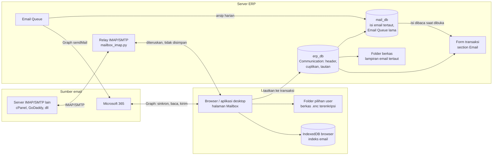
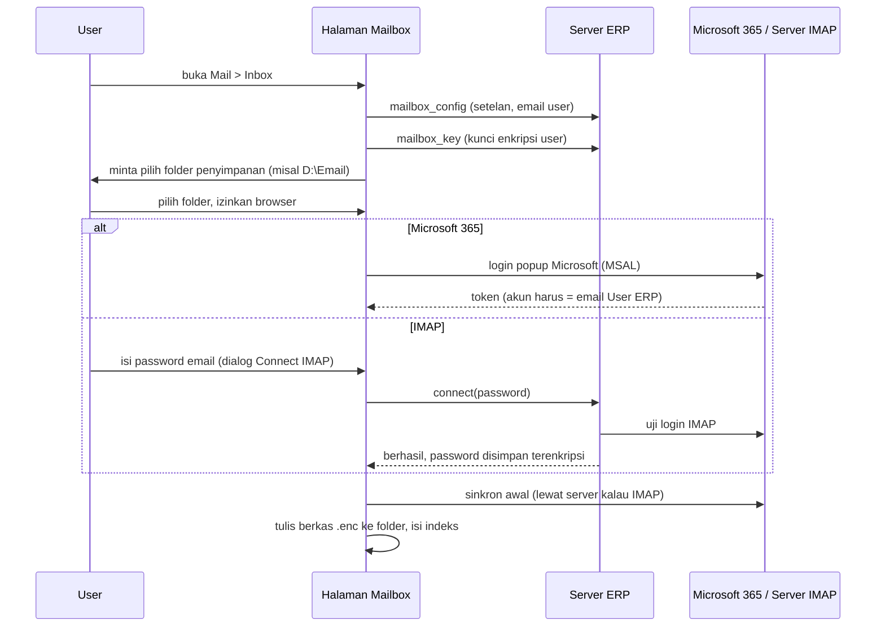
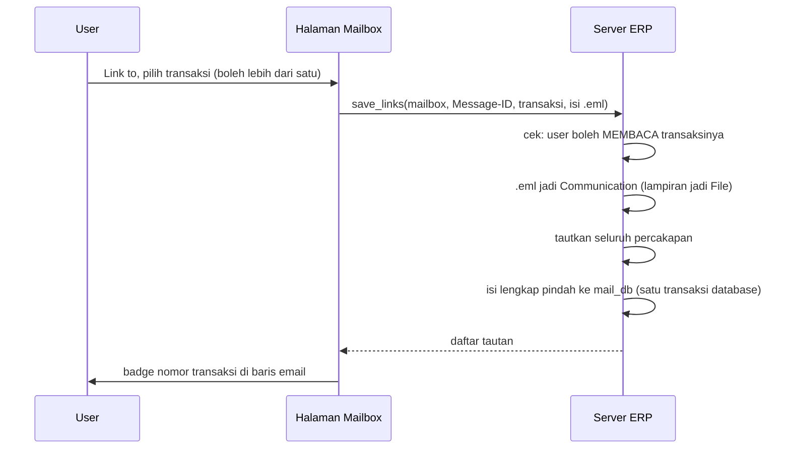
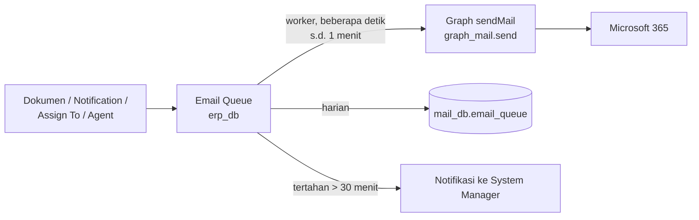

# Email di ERPNext Cakra - README

Panduan lengkap semua fitur email yang dibangun di ERPNext Cakra: alur kerja, setelan, penyimpanan di laptop, koneksi ke server mail, database terpisah, sampai pemasangan di server produksi. Per 2026-10-02.

Dokumen ini untuk admin sistem dan developer. Detail tingkat kode (nama fungsi lengkap, spesifikasi tampilan piksel per piksel, tabel gotcha) ada di [MAILBOX_REFERENCE.md](MAILBOX_REFERENCE.md).

**Status:** semua fitur di sini sudah diuji di server lokal (`erp.localhost`). Server produksi belum dipasang.

## Daftar isi

1. [Ringkasan](#1-ringkasan)
2. [Gambaran besar](#2-gambaran-besar)
3. [Di mana email disimpan](#3-di-mana-email-disimpan)
4. [Tiga cara Mailbox mengambil email](#4-tiga-cara-mailbox-mengambil-email)
5. [Alur kerja user](#5-alur-kerja-user)
6. [Email yang dikirim ERP sendiri](#6-email-yang-dikirim-erp-sendiri)
7. [Email agent, email rules, dan Orchestrator](#7-email-agent-email-rules-dan-orchestrator)
8. [Penyimpanan di laptop](#8-penyimpanan-di-laptop)
9. [Koneksi ke server mail](#9-koneksi-ke-server-mail)
10. [Database terpisah mail_db](#10-database-terpisah-mail_db)
11. [Setelan lengkap](#11-setelan-lengkap)
12. [Hak akses](#12-hak-akses)
13. [Aplikasi desktop dan add-in Outlook](#13-aplikasi-desktop-dan-add-in-outlook)
14. [Pasang di server produksi](#14-pasang-di-server-produksi)
15. [Masalah umum](#15-masalah-umum)
16. [Batasan yang diketahui](#16-batasan-yang-diketahui)
17. [Peta kode](#17-peta-kode)

## 1. Ringkasan

- **1 user = 1 mailbox**, yaitu alamat email di User ERP-nya sendiri. User tidak bisa membuka mailbox orang lain.
- **Email dibaca di halaman Mailbox** (`/desk/mailbox`, menu Mail > Inbox / Sent), tampilannya seperti Outlook web.
- **Email biasa disimpan di laptop user**, terenkripsi, di folder yang dipilih user sendiri. Server ERP tidak menyimpan salinannya.
- **Email yang ditautkan ke transaksi disimpan di server**: header di database utama `erp_db`, isi lengkapnya di database terpisah `mail_db`, lampirannya di folder berkas server.
- **Sumber email**: Microsoft 365 (langsung dari browser) atau server IMAP lain seperti cPanel atau GoDaddy (lewat server ERP). Keduanya bisa aktif bersamaan; tiap user memakai salah satu.
- **Email yang dikirim ERP sendiri** (Notification, Assign To, agent) lewat Email Queue, dikirim melalui Microsoft Graph, lalu diarsipkan ke `mail_db` tiap hari.

## 2. Gambaran besar



Yang perlu diingat dari gambar ini:

- Untuk Microsoft 365, browser user bicara **langsung** dengan Microsoft. Server ERP tidak ikut di tengah.
- Untuk IMAP, browser tidak bisa bicara IMAP, jadi server ERP **meneruskan** saja tanpa menyimpan isinya.
- Server ERP hanya menerima email saat user **menautkannya** ke transaksi.

## 3. Di mana email disimpan

| Data | Disimpan di | Keterangan |
| --- | --- | --- |
| Email biasa (tidak ditautkan) | Laptop user, folder pilihannya | Satu berkas `.enc` terenkripsi per email. Aslinya tetap di Microsoft / server IMAP |
| Indeks email (daftar, pencarian, status dibaca, bintang) | IndexedDB browser user | Subjek, pengirim, penerima, cuplikan terenkripsi |
| Header email tertaut (pengirim, penerima, subjek, tanggal, cuplikan 200 huruf, tautan transaksi) | `erp_db`, doctype Communication | Supaya tampil di timeline transaksi dan bisa dicari |
| Isi lengkap email tertaut (HTML dan teks) | `mail_db.communication_content` | Kecuali email tertaut ke modul CRM, tetap di `erp_db` |
| Lampiran email tertaut | Folder berkas server (`private/files`) | Lokasinya bisa dipindah, lihat ERPNext Custom Setting > Attachment |
| Email yang dikirim ERP (Notification, Assign To, agent) | Email Queue di `erp_db`, lalu dipindah ke `mail_db` | Sent/Error sesudah 1 hari, yang belum terkirim sesudah 3 hari |
| Kunci enkripsi laptop | Server, tabel `__Auth` (terenkripsi `encryption_key` situs) | Satu kunci per user |
| Password IMAP user | Server, tabel `__Auth` (terenkripsi) | Hanya untuk user yang memakai IMAP |
| Notifikasi email baru | `erp_db`, Notification Log | Hanya pengirim, subjek, dan Message-ID |
| Tanda Important (bintang) | Di sumbernya: flag Outlook / `\Flagged` IMAP | Ikut terlihat di Outlook atau klien email lain |

**Satu email = satu catatan di server.** Kalau dua user menerima email yang sama dan sama-sama menautkannya, server tetap menyimpan satu Communication dengan tautan yang digabung (dicocokkan lewat Message-ID).

## 4. Tiga cara Mailbox mengambil email

| Cara | Sumber | Email disimpan di | Kapan dipakai |
| --- | --- | --- | --- |
| **Local Mode, Microsoft 365** | Microsoft Graph, langsung dari browser | Laptop | Mailbox perusahaan di Microsoft 365. Ini yang dipakai sekarang |
| **Local Mode, IMAP** | Server IMAP/SMTP, diteruskan server ERP | Laptop | Mailbox di luar Microsoft 365 (cPanel, GoDaddy, Inmotionhosting, dll) |
| **Server mode** | Email Account Frappe menarik IMAP tiap menit | Server (Communication) | Hanya kalau Local Mode dimatikan. Cocok untuk satu-dua mailbox bersama, bukan untuk 50+ user |

Admin mengaktifkan lewat ERPNext Custom Setting > Mailbox:

- Centang **Local Mode** = semua user memakai Local Mode, dan server **dilarang** menarik email (Enable Incoming di semua Email Account dikunci).
- Isi **Microsoft 365** (Client ID + Tenant ID) dan/atau centang **Enable IMAP** + isi server IMAP/SMTP.

Mesin mana yang dipakai seorang user:

1. User sudah pernah Connect IMAP: **IMAP**.
2. Hanya IMAP yang diisi admin: **IMAP**.
3. Selain itu: **Microsoft 365**. Kalau admin mengisi keduanya, layar masuk Microsoft punya tombol **Use IMAP** supaya user bisa memilih IMAP.

Mengganti sumber (Microsoft ke IMAP atau sebaliknya) membuat indeks laptop mulai dari nol, karena id email kedua sumber berbeda. Emailnya diunduh ulang dari sumber.

## 5. Alur kerja user

### 5.1 Pertama kali membuka Mailbox



1. **Pilih folder penyimpanan.** Browser meminta user memilih folder di laptop, disarankan di drive D atau E (misalnya `D:\Email`). Browser lalu meminta izin baca-tulis. Izin ini diminta ulang tiap sesi browser kecuali user memilih "izinkan setiap kunjungan".
2. **Masuk ke sumber email.**
   - Microsoft 365: popup login Microsoft. Akun yang dipakai harus sama dengan email User ERP; kalau berbeda, login ditolak.
   - IMAP: dialog **Connect IMAP** meminta password email. Server menguji login dulu; password salah ditolak dengan pesan merah dan dialog tetap terbuka.
3. **Sinkron awal.** Folder Inbox dan Sent diambil (folder lain bisa ditambah di Settings). Hanya email dalam rentang simpan (bawaan 30 hari) yang diunduh, terbaru dulu. Daftar sudah bisa dipakai selagi unduhan berjalan.

Langkah 1 dan 2 cukup sekali per laptop. Sesudahnya Mailbox langsung terbuka.

### 5.2 Sinkron otomatis dan email baru

- Selama ERP terbuka di browser (halaman mana pun, tidak harus Mailbox), email baru diambil tiap **60 detik** (setelan admin, minimal 15). Tab yang sedang di belakang dibatasi browser sekitar sekali semenit. Aplikasi desktop tetap normal walau di tray.
- Hanya satu tab yang menyinkron; tab lain membaca indeks yang sama.
- Email baru yang belum dibaca di Inbox memunculkan **notifikasi**: angka di lonceng, toast di pojok, popup Windows di aplikasi desktop, dan suara kalau admin memasang file suara. Klik notifikasi membuka email itu di Mailbox.
- Email yang dihapus atau dipindah folder di Outlook atau klien lain ikut terhapus atau berpindah di laptop.
- Email yang lebih tua dari rentang simpan dihapus dari laptop (tetap ada di sumbernya).
- Tombol **Sync** mengambil email baru saat itu juga.

Sesi Microsoft berumur sekitar 24 jam. Kalau habis, muncul teguran "Microsoft session expired" dengan tombol Sign in. Email di laptop tetap bisa dibaca selama itu. Untuk IMAP, teguran muncul kalau password email berubah.

### 5.3 Membaca email

- Klik email di daftar: isinya dibuka dari berkas di laptop (didekripsi di browser), atau diunduh dari sumbernya kalau berkasnya belum ada.
- Isi email ditampilkan di dalam kotak terisolasi (iframe sandbox tanpa skrip), jadi skrip di dalam email tidak bisa berjalan.
- Email yang dibuka sendiri ditandai dibaca, juga di sumbernya. Email yang terbuka otomatis (paling atas saat folder dibuka) tidak ditandai dibaca.
- **Show email older than N days** di bawah daftar: membaca email lama langsung dari sumbernya tanpa menyimpannya ke laptop.
- **Search**: mencari pengirim atau subjek di indeks laptop, dan otomatis juga mencari di sumbernya untuk email di luar rentang simpan.

### 5.4 Menulis, membalas, meneruskan

Composer terbuka di panel kanan: From, To, CC, Subject, lampiran, transaksi yang mau ditautkan, isi, lalu signature dan kutipan email asli di bawahnya.

| Sumber | Cara kirim |
| --- | --- |
| Microsoft 365 | Browser membuat draf di Microsoft (createReply / createReplyAll / createForward supaya tetap satu utas), mengisi isi dan lampiran, lalu mengirim. Microsoft menyimpannya sendiri ke Sent Items |
| IMAP | Browser mengirim isi dan lampiran ke server ERP; server mengirim lewat SMTP sebagai user itu (dengan In-Reply-To/References untuk balasan), lalu menyimpan salinannya ke folder Sent di server IMAP |

- Signature perusahaan dipasang otomatis dari template admin, kecuali user punya signature sendiri yang ditandai bawaan.
- Gambar signature dan gambar tempelan dikirim sebagai lampiran inline, supaya tampil di Gmail dan di luar kantor.
- Kalau transaksi dipilih di composer, email yang terkirim langsung disimpan ke server dan ditautkan.
- Mengirim **tanpa** transaksi tertaut tidak menyimpan apa pun di server ERP.

### 5.5 Menautkan email ke transaksi



1. Buka email, klik **Link to** di baris judul.
2. Modal menampilkan 5 Packing List terbaru. Ketik minimal 3 huruf untuk mencari nomor transaksi di semua modul. Ledger dan log (GL Entry dan sejenisnya) tidak bisa dipilih.
3. Pilih satu atau lebih transaksi, lalu simpan.
4. Server mengimpor email itu (kalau belum ada) dan menautkannya ke **seluruh percakapan**: balasan sebelum dan sesudahnya dengan subjek yang sama dan pihak luar yang sama, dalam 30 hari.
5. Isi lengkap email pindah ke `mail_db`. Kalau langkah ini gagal, tautan ikut batal.
6. Di daftar Mailbox, nomor transaksinya tampil sebagai **badge** di baris ke-4 email.
7. **Tautan otomatis (Local Mode).** Tiap sinkron, header email baru di laptop (subjek, alamat, tanggal; bukan isi) dicocokkan server ke percakapan yang sudah tertaut: subjek sama tanpa Re:/Fwd: dan pihak luar yang sama dalam 30 hari (`outlook_addin.conversation_links`). Yang cocok disimpan ke server dengan tautan yang sama, termasuk balasan yang dikirim dari Outlook. Alamat semua User ERP tidak dihitung sebagai pihak luar. Paling banyak 50 email per sinkron, dan hanya dari sinkron lanjutan (bukan sinkron awal).

Siapa boleh menautkan: siapa pun yang boleh **membaca** transaksinya. Melepas tautan memakai aturan yang sama.

### 5.6 Email di form transaksi

- Di form transaksi muncul section **Email** di atas Comments (hanya kalau ada email tertaut): daftar email di kiri, isi di kanan. Tinggi kotaknya mengikuti tinggi layar (minimal 600 px).
- Isi email dibaca dari `mail_db`. Izinnya mengikuti dokumen transaksi.
- Tombol **Balas / Balas Semua / Teruskan** membuka composer di Mailbox. **Lepas tautan** melepas seluruh percakapan.
- Email yang sudah tampil di section ini disembunyikan dari Activity supaya tidak dobel.

### 5.7 Filter, Important, dan badge

- **Filter**, satu tombol di baris judul:
  - Baris atas: **Date** (rentang maksimal 1 bulan; lebih panjang dipotong dengan pesan) dan **Sort** (Newest first / Oldest first).
  - Baris bawah: **Unread Only**, **Linked Only** (hanya email yang tertaut transaksi), **With Attachments**, **Important Only**.
  - Label tombol jadi "Filter (n)" kalau ada saringan aktif.
- **Important**: bintang di sebelah jam pada tiap email. Klik bintang untuk menandai atau melepas tanpa membuka emailnya. Tandanya disimpan di sumber: flag Follow up di Outlook, atau `\Flagged` di IMAP. Jadi bintang yang dipasang di Outlook juga tampil di sini, dan sebaliknya.
- **Badge**: nomor transaksi tertaut di baris ke-4 tiap email, satu badge per transaksi. Hanya transaksi yang boleh dibaca user yang ditampilkan.

### 5.8 Settings user (item Settings di sidebar Mailbox)

| Tab | Isi |
| --- | --- |
| Local Email | Mailbox, folder penyimpanan (bisa diganti), **Kept on laptop** 30/60/90/180 hari (bawaan admin ditandai "default"), interval sinkron, folder yang disimpan (centang), tombol **Sign out of Microsoft** / **Disconnect IMAP**, **Reset Mailbox** |
| Signature | Signature milik user sendiri (boleh lebih dari satu, satu bawaan untuk email baru dan satu untuk balasan) |
| Rule | Rule Outlook asli (khusus Microsoft 365; disembunyikan untuk IMAP). Jalan di Microsoft walau laptop mati |

**Reset Mailbox** keluar dari sumber email, mengosongkan indeks, dan menghapus salinan email mailbox itu dari folder laptop. Email di sumbernya tidak tersentuh dan diunduh ulang sesudah masuk lagi.

## 6. Email yang dikirim ERP sendiri

Email yang dibuat sistem, bukan dari halaman Mailbox:

| Asal | Pemicu |
| --- | --- |
| Notification (bawaan Frappe) | Aturan Notification: New, Save, Submit, Days Before, dll |
| Email Assign To | Dokumen di-assign ke user lain (ToDo baru) |
| Tombol Email di form dokumen | User mengirim dari form |
| Agent (Assistant) | Agent mengirim email ke customer atau user |
| Reset password, undangan, dll | Bawaan Frappe |

**Alurnya:**



1. Email masuk **Email Queue**, tidak langsung dikirim. Alasannya: user tidak menunggu, email hanya terkirim kalau dokumennya benar-benar tersimpan, bisa dicoba ulang kalau server mail gangguan, dan ada jejak statusnya.
2. Worker Frappe mengirimnya. Hook `override_email_send` meneruskannya ke **Microsoft Graph** (`/me/sendMail`) memakai Email Account default outgoing yang punya field `cmi_graph_connected_app`. SMTP tidak dipakai karena tenant Microsoft mematikan SMTP AUTH.
3. **Arsip harian** ke `mail_db`: Sent/Error sesudah 1 hari, Not Sent/Sending/Partially Sent sesudah 3 hari (angka diatur admin).
4. **Notifikasi tertahan**: email yang belum terkirim lebih dari 30 menit memunculkan notifikasi lonceng ke semua System Manager, sekali per email.

Kiriman dari Mailbox Local Mode **tidak** lewat Email Queue: Microsoft 365 dikirim langsung oleh browser, IMAP dikirim langsung oleh server saat Send diklik.

**Email Assign To:** kalau dokumen di-assign ke user lain, user itu menerima email dari Email Template (bawaan "Assignment Notification"). Tidak dikirim kalau Allow dimatikan, kalau user meng-assign dirinya sendiri, atau kalau user tujuan nonaktif atau tanpa email. Email bawaan Frappe untuk assignment dimatikan supaya tidak dobel. Link di email membuka form desk, atau halaman CRM untuk Lead dan Inquiry.

## 7. Email agent, email rules, dan Orchestrator

**Agent (Assistant)**

- Agent mengirim email lewat `frappe.sendmail` (langsung diproses, tidak menunggu antrean). Jalurnya sama: Email Queue lalu Graph. Subjek diberi tag `[#<tag>]` supaya balasan customer bisa dikembalikan ke agent yang benar.
- Email masuk untuk agent ditangkap hook `Communication.after_insert`. Balasan dicocokkan lewat threading Message-ID atau tag di subjek, lalu dicatat ke thread Agent Mail.
- Semua chat dan email agent dicatat permanen di **Agent History** dan tidak hilang walau agent di-reset.

**Email rules (auto-reply Packing List)**, di Assistant Settings > Auto-Reply, tabel Email Rule:

- Email baru dicocokkan ke Packing List lewat No BL atau No container di subjek/isi, dan pengirimnya harus kontak customer di dokumen itu.
- AI memilih REPLY, REVIEW, atau INFO beserta topiknya. **Kode** yang memutuskan boleh kirim: pengirim terverifikasi, rule aktif, topik dicentang, dan keputusan REPLY. REVIEW menjadi draf untuk user sekaligus Agent Task "balas" di Orchestrator (kalau rule Email aktif), INFO menjadi notifikasi.
- Batas balasan per hari per rule.

**Orchestrator** (halaman Agent Inbox):

- Email customer yang **tertaut ke transaksi** (termasuk yang ditautkan dari Mailbox Local Mode) dan belum dibalas menjadi Agent Task "balas" untuk pemegang transaksinya. Kalau tidak ditangani, task naik bertingkat PIC, Controller, lalu Admin.
- Aktif kalau rule **Email** di Assistant Settings > Orchestrator dinyalakan (bawaannya mati).
- Task selesai sendiri begitu ada email keluar yang tertaut ke transaksi yang sama. Di Local Mode, balasan user (dari Mailbox maupun Outlook) ikut tertaut otomatis lewat tautan percakapan (bagian 5.5), jadi task tidak salah dieskalasi.
- Workflow lain (dokumen apa pun) dirancang di halaman Orchestrator > tab Workflow. Lihat `ERPCakra/assistant/README_ORCHESTRATOR.md`.

**Local Mode dan email masuk untuk agent.** Selama Local Mode ON, server tidak menarik email dari Email Account biasa (Enable Incoming dikunci). Agent tetap bisa **mengirim**. Supaya balasan customer ke agent dan auto-reply email rules tetap jalan, centang **Mailbox Agent** (`cmi_agent_mailbox`) di Email Account khusus agent: akun itu boleh Enable Incoming walau Local Mode ON. Jangan centang untuk mailbox orang.

## 8. Penyimpanan di laptop

**Susunan folder**

```text
<folder pilihan user>\
  <alamat email>\
    <folder Outlook / IMAP>\
      <yyyy-mm>\
        <yyyymmdd-hhmm> <tanda>.enc
```

Contoh: `D:\Email\riza@cakraindo.com\Inbox\2026-10\20261002-0915 3fa9c1d2.enc`

- Nama berkas tanpa subjek. Isinya terenkripsi, nama berkas tidak, jadi subjek sengaja tidak dipakai.
- Jalur disimpan relatif. Kalau user memindah folder (misalnya dari D: ke E:), cukup pilih folder baru di Settings tanpa unduh ulang.
- Browser yang tidak punya pemilih folder (Firefox, Safari) menyimpan di penyimpanan internal browser (OPFS). Yang didukung penuh: Edge, Chrome, dan aplikasi desktop.

**Enkripsi**

- AES-256-GCM. Satu kunci acak per user, disimpan di server (tabel `__Auth`, terenkripsi `encryption_key` situs). Browser memegang kunci di memori saja.
- Akibatnya salinan di laptop **hanya terbaca selama user bisa login ERP**. Berkas yang disalin keluar, laptop yang hilang, atau akun yang dinonaktifkan = isinya tidak terbaca.
- Format berkas: `"CME1"` (4 byte) + IV acak 12 byte + ciphertext beserta tag 16 byte.
- Indeks di IndexedDB juga dienkripsi untuk kolom subjek, pengirim, penerima, CC, cuplikan, dan Message-ID. Yang terbuka hanya kolom yang perlu untuk mengurutkan dan menyaring: folder, tanggal, dibaca, lampiran, bintang.

**Rentang simpan**

- Bawaan admin 30 hari (0 = simpan semua). Tiap user boleh memilih 30, 60, 90, atau 180 hari.
- Email yang lebih lama dihapus dari laptop tiap sinkron, termasuk folder bulan yang kosong. Email itu tetap bisa dibaca dan dicari langsung dari sumbernya.

**Membuka tanpa ERP** (misalnya karyawan keluar atau audit)

1. System Manager: form User > **Export Mailbox Key** (satu user), atau daftar User > Menu > **Export Mailbox Keys** (banyak user sekaligus, jadi CSV `user,email,key`). Setiap ekspor tercatat di timeline User itu.
2. Buka `/assets/erpnext_custom/mailbox_decrypt.html` di Edge atau Chrome. Alat ini bisa dipakai offline, tanpa internet.
3. Tempel kunci atau muat CSV, pilih folder `.enc` dan folder hasil. Hasilnya berkas `.eml` biasa yang bisa dibuka Outlook.

Satu email juga bisa diunduh polos dari Mailbox lewat tombol **Download .eml** di panel baca.

**Backup kunci** = backup database + `site_config.json` (berisi `encryption_key`). Kalau keduanya hilang, salinan laptop tidak terbaca, tapi Mailbox mengunduh ulang dari sumbernya. Data tidak hilang karena aslinya tetap di Microsoft / server IMAP.

**Reset otomatis**

- Login dengan akun Microsoft yang salah: ditolak.
- Email User diganti admin: indeks laptop untuk alamat lama dilupakan otomatis.
- Ganti sumber (Microsoft dan IMAP): indeks dimulai dari nol.

## 9. Koneksi ke server mail

### 9.1 Microsoft 365 (Local Mode)

- Browser login sendiri ke Microsoft dengan MSAL (aplikasi tipe SPA, tanpa client secret). Token disimpan di browser.
- Semua panggilan langsung ke `https://graph.microsoft.com`:

| Kegiatan | Panggilan Graph |
| --- | --- |
| Sinkron | delta query per folder, 100 email per halaman, titik lanjut disimpan tiap halaman |
| Unduh isi | `/me/messages/{id}/$value` (.eml utuh), 3 unduhan paralel |
| Tandai dibaca / bintang | PATCH `isRead` / `flag` |
| Kirim | draf, lalu `/send`; lampiran di atas 3 MB lewat upload session |
| Email lama / cari | `$filter` tanggal / `$search` |
| Rule | `/me/mailFolders/inbox/messageRules` (izin terpisah) |

- Id email memakai ImmutableId, jadi email yang dipindah folder tidak diunduh ulang.
- Throttling Microsoft (429/503/504) ditunggu sesuai `Retry-After` lalu diulang.

### 9.2 IMAP (Local Mode)

Server ERP menjadi perantara. Tiap panggilan membuka koneksi IMAP/SMTP **atas nama user yang sedang login** (alamat email User ERP + password yang disimpan), mengambil yang diminta, lalu menutupnya. Isi email tidak disimpan di server.

| Endpoint (`erpnext_custom.mailbox_imap.*`) | Gunanya |
| --- | --- |
| `connect` / `disconnect` | Uji login lalu simpan password / hapus password |
| `folders` | Daftar folder; Inbox, Sent, Drafts, Junk, Trash dikenali dari penanda SPECIAL-USE atau namanya |
| `state` | Semua `[uid, dibaca, bintang]` dalam rentang simpan; browser mencocokkannya dengan indeks |
| `headers` | Data indeks untuk email baru (per 100) |
| `raw` | Isi .eml satu email |
| `mark_read`, `set_flag` | Tandai dibaca, bintang |
| `older`, `find` | Email lama / cari, cari lewat Message-ID |
| `send` | Kirim lewat SMTP lalu simpan salinan ke folder Sent |

- Server, port, dan keamanan diatur admin, satu untuk semua user. Login selalu memakai email User ERP, jadi user tidak bisa membuka mailbox orang lain.
- Galat wajar (password salah, server mati, folder hilang) dikembalikan sebagai jawaban biasa, bukan pop-up, supaya sinkron otomatis tiap menit tidak mengganggu layar.
- Satu koneksi per panggilan. Kalau server mail membatasi jumlah login, perlu pool koneksi per user.

### 9.3 Server mode (kalau Local Mode mati)

- Email Account Frappe login IMAP dengan OAuth (Connected App Microsoft) dan menarik tiap menit ke Communication, per folder.
- Bagian Frappe yang rusak untuk banyak folder sudah diganti: titik awal per folder, surat terakhir yang selalu dikembalikan server tidak diunduh ulang, nama lampiran dipotong 140 karakter.
- Kirim tetap lewat Graph (lihat bagian 6).
- Detail lengkap: MAILBOX_REFERENCE.md bagian Server mode.

## 10. Database terpisah mail_db

Tujuannya: database utama `erp_db` tidak membesar karena email.

**Isinya**

| Tabel | Isi |
| --- | --- |
| `communication_content` | Isi lengkap (HTML + teks) email yang ditautkan ke transaksi. Kunci = nama Communication |
| `email_queue`, `email_queue_recipient` | Email Queue yang sudah lewat (salinan utuh) |
| `email_queue_alert` | Catatan email tertahan yang sudah diberitahukan (supaya sekali saja) |

**Kapan data pindah**

- Saat **menautkan**: isi email pindah ke `mail_db`; di `erp_db` tinggal header + cuplikan 200 huruf. Saat dilepas, kebalikannya. Penautan dan pemindahan terjadi dalam satu transaksi database: gagal satu, batal semua.
- Email yang tertaut ke modul **CRM** (Inquiry, Tender, dll) isinya tetap di `erp_db`, karena aplikasi CRM membacanya langsung.
- **Email Queue** tiap hari (scheduler `daily`).

**Cara dibuat**

- Otomatis saat `bench migrate` (`extra_db.ensure`):
  1. Mencoba membuat database sebagai user situs.
  2. Kalau ditolak, memakai `mariadb_root_password` di `common_site_config.json` untuk membuat database dan memberi GRANT ke user situs.
  3. Kalau password root tidak ada, ditulis ke Error Log "extra_db.ensure: mail_db", migrate tetap lanjut. Admin perlu GRANT manual sekali.
- Nama database: `mail_db`, atau isi `mail_db` di `site_config.json` kalau satu MariaDB dipakai beberapa situs.
- Database `fleet_db` (Fleet) dibuat dengan cara yang sama.

**Backup**

`bench backup` **tidak** mencakup `mail_db`. Backup-nya:

```bash
bench --site <situs> execute erpnext_custom.mail_archive.backup
```

Hasilnya `sites/<situs>/private/backups/<yyyymmdd_hhmmss>-mail_db.sql.gz`. Jadwalkan lewat cron server. Frappe tidak menghapus berkas ini otomatis.

**Perkiraan ukuran** (100 user, 20 email ditautkan per user per hari, 250 hari kerja): `erp_db` sekitar 0,5 GB/tahun (header), `mail_db` sekitar 10 GB/tahun, lampiran sekitar 56 GB/tahun di disk.

## 11. Setelan lengkap

### 11.1 Microsoft Entra (Azure), sekali oleh admin tenant

1. **App registration** (single tenant). Catat Application (client) ID dan Directory (tenant) ID.
2. **Platform Single-page application** (Local Mode). Redirect URI persis: `https://<domain ERP>/assets/erpnext_custom/mailbox_auth.html`. Jangan didaftarkan di platform Web.
3. **Platform Web** (Server mode dan kirim dari ERP lewat Graph). Redirect URI: `https://<domain ERP>/api/method/frappe.integrations.doctype.connected_app.connected_app.callback/<nama Connected App>`, plus **client secret** (isi Value, bukan Secret ID).
4. **API permissions (Delegated)**, lalu **Grant admin consent**:

| Izin | Untuk |
| --- | --- |
| Graph `Mail.ReadWrite` | Local Mode: sinkron, tandai dibaca, bintang, draf |
| Graph `Mail.Send` | Local Mode dan kirim dari ERP |
| Graph `User.Read` | Local Mode: cek akun = email User |
| Graph `MailboxSettings.ReadWrite` | Tab Rule (opsional) |
| `offline_access` | Connected App (refresh token) |
| Exchange `IMAP.AccessAsUser.All`, `SMTP.Send` | Connected App / Server mode |

Azure hanya menerima redirect `http://` untuk `localhost`. Domain lain wajib https.

### 11.2 File konfigurasi server (tidak masuk git)

| Berkas | Isi |
| --- | --- |
| `sites/<situs>/site_config.json` | `host_name` = alamat publik ERP persis (`https://...`), `encryption_key` (backup!), opsional `mail_db` |
| `sites/common_site_config.json` | `mariadb_root_password`, supaya migrate bisa membuat `mail_db` sendiri |
| Scheduler | Wajib aktif (`bench --site <situs> enable-scheduler`): antrean email, arsip, notifikasi tertahan |

### 11.3 ERPNext Custom Setting, tab Mailbox

**Section Microsoft 365**

| Field | Isi | Bawaan |
| --- | --- | --- |
| Local Mode | Centang = semua user Local Mode, server dilarang menarik email | mati |
| Application (Client) ID | ID app registration (platform SPA) | - |
| Directory (Tenant) ID | ID tenant | - |
| Simpan Email di Laptop (hari) | Rentang simpan bawaan semua user, 0 = semua | 30 |
| Auto Sync Interval (seconds) | Interval sinkron otomatis, minimal 15 | 60 |

**Section IMAP** (tampil kalau Local Mode ON)

| Field | Isi | Bawaan |
| --- | --- | --- |
| Enable IMAP | Aktifkan IMAP untuk semua user | mati |
| IMAP Server | Misal `mail.domainanda.com` | - |
| IMAP Port | 993 (SSL) atau 143 | 993 |
| IMAP Use SSL | Mati = port 143, STARTTLS dipakai kalau server menawarkannya | nyala |
| SMTP Server | Kosong = sama dengan IMAP Server | - |
| SMTP Port | 465 (SSL) atau 587 (STARTTLS) | 465 |
| SMTP Security | SSL, STARTTLS, atau None | SSL |

User tidak perlu mengisi apa pun selain password emailnya sendiri di Mailbox.

**Section Email Archive (mail_db)**

| Field | Bawaan |
| --- | --- |
| Move Sent / Error After (days) | 1 (0 = tidak dipindah) |
| Move Not Sent / Sending After (days) | 3 (0 = tidak dipindah) |
| Alert When Not Sent After (minutes) | 30 (0 = mati) |

**Section Company Signature**

- **Company Name in Signature**: nama PT di signature.
- **Signature Builder**: susun drag and drop (kolom, logo, nama, jabatan, alamat cabang, telepon, HP, website, ikon sosial, baris "Regards," di atas). Pratinjau memakai data user yang login.
- **Signature HTML (advanced)**: template Jinja hasil builder.

Sumber data signature per user:

| Data | Diambil dari |
| --- | --- |
| Nama, email | User |
| Jabatan | User > Job Title (`cmi_job_title`) |
| HP | User > Mobile No |
| Kantor cabang | User > Branch (CMI Office) |
| Alamat dan telepon kantor | Master **Branch** dengan nama yang sama (field Address dan Phone), kalau kosong dari CMI Office |
| Website | Company > Website |

Jangan mengetik nomor telepon di Prefix/Suffix builder. Isi master datanya, supaya tiap user mendapat datanya sendiri.

### 11.4 ERPNext Custom Setting, tab Notification

| Field | Isi |
| --- | --- |
| Allow Email on Assign To | Kirim email saat dokumen di-assign |
| Email Template | Template email assignment (bawaan "Assignment Notification") |
| Sound File | Suara notifikasi (mp3/wav/ogg/m4a, maksimal 1 MB), diputar di browser dan aplikasi desktop |

### 11.5 ERPNext Custom Setting, tab Attachment

- **Attachment Folder**: lokasi berkas lampiran (termasuk lampiran email tertaut) di server. Kosong = folder situs bawaan.
- **Copy & Migrate**: salin berkas ke lokasi baru. Folder lama tidak dihapus, hanya diganti nama. **Delete Old Folders** untuk menghapusnya.
- Di Windows, folder tujuan harus case-sensitive (`fsutil file setCaseSensitiveInfo <folder> enable`, dijalankan sebagai admin), karena Frappe bisa punya dua berkas yang namanya hanya beda huruf besar-kecil.

### 11.6 Email Account

| Akun | Setelan |
| --- | --- |
| Akun kirim ERP (misal "M365 Admin") | Auth OAuth + Connected App; **Enable Outgoing + Default Outgoing**; field `cmi_graph_connected_app` = Connected App yang sama (artinya kirim lewat Graph). Enable Incoming **mati** selama Local Mode |
| Akun lama yang kredensialnya mati | Lepas flag default-nya, karena Frappe menyimpan ulang akun default lama saat akun baru disimpan dan gagalnya ikut membatalkan |

Connected App: provider Microsoft, Client ID + Client Secret (platform Web), Authorization URI `https://login.microsoftonline.com/<tenant>/oauth2/v2.0/authorize`, Token URI `.../oauth2/v2.0/token`, scope sesuai 11.1. Klik **Connect** sebagai pemilik mailbox. Jangan pernah menyimpan ulang dokumen Token Cache.

### 11.7 Master data

- **User**: email = alamat mailbox (Microsoft atau IMAP), Branch, Job Title, Mobile No.
- **Branch**: Address (satu baris per baris alamat) dan Phone. Nama Branch = nama CMI Office.
- **Contact customer** dengan email, untuk email rules agent.

### 11.8 Assistant Settings (agent)

- Tab Auto-Reply: `auto_reply_enabled`, tabel Email Rule (menu Packing List, aktif, batas per hari, topik REPLY, catatan). Bawaannya mati.
- Tab Orchestrator: rule Email, Fleet, Job (bawaannya mati).

## 12. Hak akses

| Hal | Siapa |
| --- | --- |
| Halaman Mailbox (Inbox, Sent, Settings) | Semua user desk (role Desk User), tanpa role khusus |
| Mailbox yang dibuka | Hanya milik sendiri (email User ERP) |
| Menautkan dan melepas tautan | Siapa pun yang boleh **membaca** transaksinya |
| Melihat tautan (badge, section Email) | Hanya transaksi yang boleh dibaca user |
| Export Mailbox Key | System Manager, tercatat di timeline User |
| Menu Setting di sidebar Mail (Email Account, Email Domain, Email Queue, Notification Settings) | System Manager |
| Enable Incoming Email Account | Ditolak selama Local Mode ON |
| Notifikasi email tertahan | System Manager |

## 13. Aplikasi desktop dan add-in Outlook

**Aplikasi desktop "Cakra ERP"** (Windows, Electron, sumber di `desktop/`)

- Jendela sendiri seperti Outlook, khusus Mail. Halaman ERP lain dibuka di browser biasa, dan ada tombol **Back to Mail**.
- Hidup di tray dan ikut terbuka saat Windows login, jadi sinkron dan notifikasi tetap jalan walau jendela ditutup. Notifikasi muncul sebagai popup Windows.
- **Alamat server diatur di aplikasi** (sejak 1.0.9): halaman **Server** lewat tombol Server di sidebar aplikasi, klik kanan ikon tray > Server..., atau muncul sendiri kalau server tidak terjangkau. Isi alamat ERP (misal `https://app.oakglobalmaritim.com`), Save, aplikasi dibuka ulang ke server itu. Disimpan per laptop di `%APPDATA%\Cakra ERP\server.json`. Jadi satu installer bisa dipakai untuk semua server; `erpUrl` saat build hanya alamat bawaan.
- Update otomatis dari `https://<domain>/files/` server yang dipilih (cek tiap 6 jam). Unduhan pertama lewat tombol **Access on Device** di menu Mail.
- Tombol **Display** untuk ukuran teks dan font, per laptop.
- Build dan deploy: `desktop/README.md` dan MAILBOX_REFERENCE.md bagian Aplikasi desktop Windows.

**Add-in Outlook** (prototipe, `public/outlook/`)

- Panel di Outlook untuk menautkan email yang sedang dibaca ke transaksi. Memakai endpoint yang sama dengan Mailbox Local Mode.
- Belum siap produksi: masih memakai API key per user dan alamat localhost.

**Frappe CRM**: tombol Mail di sidebar CRM membuka `/desk/mailbox` di tab baru.

## 14. Pasang di server produksi

1. Merge kode ke branch prod, `git pull` di server.
2. Isi `mariadb_root_password` di `common_site_config.json` **sebelum** migrate (atau siapkan GRANT manual untuk `mail_db`).
3. `bench --site <situs> migrate`, `bench clear-cache`, restart backend, worker antrean, dan **frontend** (kalau tidak, muncul 502). Migrate membuat semua custom field: IMAP Folder `cmi_is_sent`, Communication `cmi_important`, field ERPNext Custom Setting, dan lainnya.
4. Sesudah migrate, cek: `show databases` berisi `mail_db`, dan Error Log tidak berisi "extra_db.ensure". Cek juga layout CRM, karena migrate pernah mengembalikan CRM Fields Layout ke bawaan.
5. Azure: tambah redirect SPA dan redirect Web untuk domain prod (11.1).
6. `site_config.json`: `host_name` https prod, scheduler aktif, backup `encryption_key`.
7. ERPNext Custom Setting tab Mailbox: Local Mode, Client ID, Tenant ID, rentang simpan, interval sinkron, IMAP (kalau dipakai), Email Archive, nama perusahaan, susunan signature (atau salin `mailbox_signature_layout` dan `mailbox_signature_template` dari server lama).
8. Email Account kirim: Outgoing + Default Outgoing + `cmi_graph_connected_app`; Incoming mati.
9. Master data: email User, Branch, Job Title, Mobile No, Address dan Phone tiap Branch.
10. Jadwalkan backup `mail_db` lewat cron server.
11. Aplikasi desktop: ERPNext Custom Setting > tab **Desktop App** > **Upload Installer**, pilih 3 berkas dari `desktop/dist` (installer boleh sudah diganti nama). Hanya 3 versi terakhir disimpan. Satu installer untuk semua server; user mengisi alamat server di aplikasi.
12. CRM: `yarn build` app `crm_cakra` supaya tombol Mail muncul.
13. Uji: satu user pilih folder, login, sinkron, buka email, tautkan ke transaksi, lihat di section Email transaksi, kirim balasan, cek notifikasi.

## 15. Masalah umum

| Gejala | Penyebab | Yang dilakukan |
| --- | --- | --- |
| Mailbox minta pilih folder lagi | Izin folder berlaku per sesi browser | Klik tombolnya dan pilih "izinkan setiap kunjungan" |
| "Microsoft session expired" | Sesi Microsoft di browser habis (sekitar 24 jam) | Klik Sign in to Microsoft. Email di laptop tetap terbaca |
| "IMAP login failed" | Password email berubah | Klik Connect IMAP dan isi password baru |
| Login Microsoft ditolak "is not mailbox" | Login dengan akun lain | Login dengan akun yang sama dengan email User ERP |
| AADSTS50011 / AADSTS9002326 | Redirect URI tidak cocok / redirect SPA terdaftar di platform Web | Samakan redirect persis, daftarkan di platform SPA |
| AADSTS7000215 | Client Secret diisi Secret ID | Isi Value secret |
| SMTP 535 5.7.139 | Tenant mematikan SMTP AUTH | Kirim lewat Graph (`cmi_graph_connected_app`) |
| Email dari ERP tidak terkirim | Scheduler mati, atau tidak ada Email Account default outgoing | `bench enable-scheduler`, cek Email Account; lihat Email Queue |
| Notifikasi "Email not sent after 30 minutes" | Email tertahan di antrean | Buka Email Queue itu, baca pesan error, kirim ulang |
| Enable Incoming tidak bisa disimpan | Local Mode ON | Memang dikunci. Matikan Local Mode kalau benar-benar perlu Server mode |
| Isi email kosong di form transaksi | `mail_db` tidak bisa dibaca (database hilang / tanpa GRANT) | Cek `mail_db` dan hak user situs |
| JS baru tidak terpakai | Browser memakai salinan lama | Naikkan `?v=` di `hooks.py`, restart backend |
| 502 Bad Gateway sesudah restart | Nginx frontend memegang alamat backend lama | Restart kontainer frontend |
| Pop-up "does not have doctype access" di Mailbox | Tautan ke transaksi yang tidak boleh dibaca (sudah diperbaiki) | Pastikan kode terbaru terpasang |

Daftar gotcha developer yang lebih panjang: MAILBOX_REFERENCE.md bagian Gotcha.

## 16. Batasan yang diketahui

- Local Mode: tautan otomatis balasan hanya jalan selama ERP terbuka di browser salah satu peserta percakapan (sinkron berjalan di browser). Pencocokan lewat subjek + pihak luar, jadi dua urusan bersubjek sama dengan pihak yang sama dalam 30 hari bisa tersambung.
- Local Mode: agent hanya menerima email lewat Email Account yang dicentang Mailbox Agent (bagian 7).
- Bintang yang diklik tepat saat sinkron otomatis berjalan bisa hilang sebentar, lalu muncul lagi di sinkron berikutnya (paling lama sekitar 1 menit).
- IMAP: server yang otomatis menyimpan kiriman SMTP ke Sent (misalnya Gmail) akan punya salinan dobel. cPanel dan GoDaddy tidak.
- IMAP: satu koneksi per panggilan; mailbox dengan rentang "semua email" yang sangat besar membaca ulang daftar UID tiap sinkron.
- Rule hanya untuk Microsoft 365.
- Firefox dan Safari tidak bisa memilih folder laptop (email disimpan di penyimpanan browser).
- Backup `mail_db` belum dijadwalkan otomatis. Belum ada layar untuk melihat riwayat Email Queue di `mail_db`.
- Folder laptop milik alamat email lama tidak dihapus otomatis saat email User diganti (isinya tetap terenkripsi).
- Add-in Outlook masih prototipe.
- Belum diuji oleh banyak user sungguhan sekaligus, dan belum dipasang di produksi.

## 17. Peta kode

Path relatif ke paket `erpnext_custom/erpnext_custom/` kecuali disebut lain.

| Berkas | Isi |
| --- | --- |
| `erpnext_custom/page/mailbox/mailbox.js` | Halaman Mailbox: `Mailbox` (tampilan, composer, filter, bintang, tautan) dan `LocalMailbox` (sumber data Local Mode, Settings) |
| `public/js/mailbox_local.js` | Mesin Local Mode: `LocalMail` (Microsoft 365) dan `ImapMail` (IMAP). Folder laptop, enkripsi, IndexedDB, sinkron otomatis. Dimuat di semua halaman desk |
| `mailbox_imap.py` | Relay IMAP/SMTP untuk Local Mode IMAP |
| `outlook_addin.py` | `mailbox_config`, kunci Mailbox, ekspor kunci, notifikasi Local Mode, `lookup` / `save_links` (Mailbox dan add-in) |
| `mail_inbox.py` | Tautan (`link_transaction`, `list_links`, `linked_mail`, `set_important`), percakapan, section Email transaksi, Server mode (tarik IMAP per folder) |
| `mail_archive.py`, `extra_db.py` | `mail_db`: pindah isi, arsip Email Queue, notifikasi tertahan, backup, pembuatan database |
| `graph_mail.py` | Kirim lewat Graph (`override_email_send`), kunci Enable Incoming selama Local Mode |
| `assignment_mail.py` | Email Assign To |
| `attachment_storage.py` | Lokasi folder lampiran |
| `public/js/linked_mail.js` | Section Email di form transaksi |
| `public/js/notification_badge.js` | Lonceng, toast, suara, popup aplikasi desktop |
| `public/js/signature_builder.js`, `erpnext_custom/doctype/mailbox_signature/` | Signature perusahaan dan signature user |
| `public/mailbox_auth.html`, `public/mailbox_decrypt.html`, `public/vendor/` | Redirect login MSAL, alat dekripsi offline, MSAL dan postal-mime |
| `erpnext_custom/doctype/erpnext_custom_setting/` | Tab Mailbox, Notification, Attachment |
| `desktop/` (di luar paket Python) | Aplikasi Windows Electron |
| `public/outlook/` | Add-in Outlook (prototipe) |
| `ERPCakra/assistant/assistant/assistant/fleet.py` | Email agent (kirim, terima, email rules) |
| `ERPCakra/assistant/assistant/assistant/orchestrator.py` | Orchestrator (email tertaut jadi Agent Task) |

**Tes**

| Perintah | Menguji |
| --- | --- |
| `node erpnext_custom/test_mailbox_local.js` | Fungsi murni mesin Local Mode (baris indeks, bintang, id IMAP, nama berkas) |
| `from erpnext_custom.test_mailbox import run; run()` (bench console) | Filter folder, halaman untuk Desk User, aturan tautan |
| `from erpnext_custom.test_mail_folders import run; run()` | Tarik IMAP per folder (Server mode) |
| `from erpnext_custom.test_graph_mail import run; run()` | Kirim lewat Graph |
| `from erpnext_custom.test_assignment_mail import run; run()` | Email Assign To |
| `bench --site <situs> execute assistant.assistant.test_email_rules.run` | Email rules agent |
| `bench --site <situs> execute assistant.assistant.test_orchestrator.run` | Orchestrator |

IMAP diuji end-to-end dengan server mail tiruan GreenMail di Docker (`greenmail/standalone`, jaringan `erp_cakra_frappe_net`, IMAP 3143, SMTP 3025, SSL dimatikan di setelan). Jangan menguji IMAP dengan akun Administrator yang sedang memakai Microsoft 365: mengganti sumber mengosongkan indeks laptop-nya.

Sesudah mengubah berkas `.py`: restart backend dan worker antrean (dan frontend kalau 502). Sesudah mengubah JS di `app_include_js`: naikkan `?v=` di `hooks.py`.
